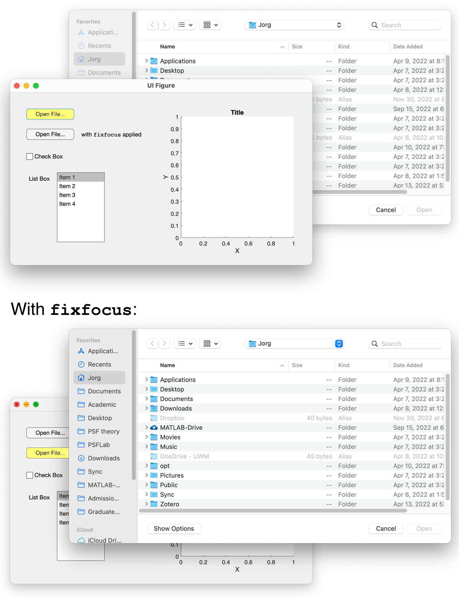
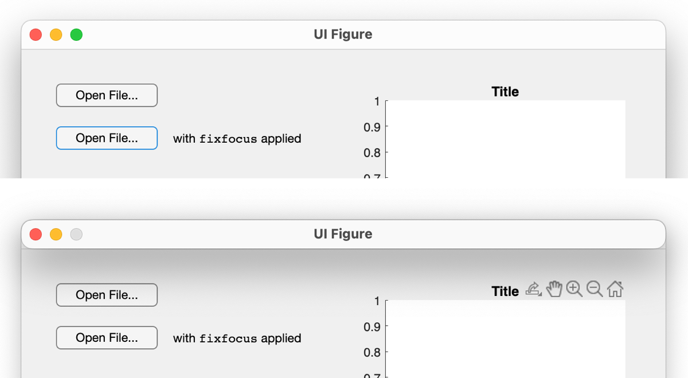

[](https://www.mathworks.com/matlabcentral/fileexchange/165961-fixfocus)

# fixfocus

**fixfocus** provides a workaround for an annoying, long-standing MATLAB user interface bug that occurs when a selection dialog box is opened in presence of an app/`uifigure` window that has focus.

## Background

Since at least R2016b, MATLAB does **not** move the selection dialog box into focus when an app or `uifigure` window is present and has focus. Instead, the selection dialog box appears **behind** the app or `uifigure` window:



`fixfocus` provides a workaround that automatically brings the selection dialog box into focus. 

When the the selection dialog box is closed by the user, `fixfocus` then returns the focus to the app/`uifigure` window -- thus fixing a second user interface bug that persists to this day in MATLAB.

## Usage

Sandwich the call to the selection dialog box (e.g., a call to `uigetfile`) between the following two lines:

```matlab
ff = fixfocus;
% 'uigetfile', 'uitputfile', 'uigetdir', 'uiopen', or 'uisave' command
delete(ff);
```

This works with `uigetfile`, `uitputfile`, `uigetdir`, `uiopen`, and `uisave` calls.

## How It Works

Internally, `fixfocus` creates a temporary dummy `figure` that takes the focus away from the app/`uifigure` window. This allows the selection dialog box to move into focus when called.

To be as unobtrusive as possible, the dummy `figure` consists of just the title bar (zero height), perfectly superimposed on top of the title bar of the app/`uifigure` window:



This "title bar `figure`" only appears briefly. 

As an option, `fixfocus` can be called with a text argument (such as `'Just a second...'`). This text is then displayed in the title bar instead of the app/`uifigure` title, which is the default.

> [!NOTE]  
> Other potential workarounds, such as moving the dummy figure off the screen, making it invisible from the start, shrinking it to zero width and height, etc., are unfortunately not working as expected. Also, there is currently no official workaround from The MathWorks regarding these bugs.

> [!IMPORTANT]  
> Unlike `uifigure` windows, `figure` windows do not adjust to dark mode. Therefore, the temporary dummy `figure` is much more noticeable in dark mode. (The title bar color of a `figure` cannot be set in MATLAB.)

## Acknowledgments

`fixfocus` was inspired by [this discussion in the MATLAB Answers forum](https://www.mathworks.com/matlabcentral/answers/296305-appdesigner-window-ends-up-in-background-after-uigetfile#answer_427026).
