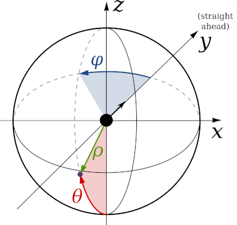

1. TOC
{:toc}

# Overview of Motion_Maker_G4

This set of MATLAB scripts and GUIs can be used to design patterns (primarily for displaying motion, rather than pictures of objects) on a G4 display. Patterns are generated using the `Motion_Maker_G4.m` script based on input parameters that describe the desired motion. These scripts output two types of pattern files: The first type is a .mat file which contains the created pattern matrix (named `Pats`) and all the pattern parameters so that it can be easily read back into MATLAB. The second type is a .pat file containing a binary vector of the pattern that can be quickly accessed by the Display Controller. Only the .pat file is necessary to be displayed on a G4 arena, though the .mat file is needed to be easily loaded back into MATLAB for viewing, debugging, or for creating experiments with the G4_Protocol_Designer.

## Mapping the display pixel coordinates in 3D. 

[{:width="30%" .float-right}](support/coordinate%20conventions.pdf)

Motion_Maker_G4 generates patterns based on the 3D coordinates of the pixels in the display from the perspective of an observer located at the origin `[0,0,0]`. Therefore, for this software to generate the correct patterns, it must know the size, shape, and orientation of the arena it is connected to. The image on the right and the file [coordinate conventions.pdf](support/coordinate%20conventions.pdf) show the details about the coordinate systems used in these scripts. For standard cylindrical arenas, these coordinates can easily be computed by running `configure_arena` and inputting the arena parameters as described in the [software setup section](../docs/G4_Software_Setup.html). By default, cylindrical arenas are modelled based on their shape as a polygonal cylinder made up of flat LED panels. However, one attribute of this model is that horizontal lines that are drawn according to the pixels' latitude coordinate can appear wavy when drawn above or below the “equator” of the arena (i.e. the height of the arena where the observer is located). This is due to the fact that LEDs in the middle of LED panels will appear to have a different height as those near the edges of LED panels (i.e. pixels in the same row of a panel will not always have the same latitude). If this attribute is not desired, another option in the `configure_arena` GUI is to model the arena as a smooth, perfectly round cylinder, which will cause latitude lines to be drawn perfectly straight along the horizontal of the cylinder.

## Creating and visualizing patterns in the GUI.

Running `Motion_Maker_G4_gui` opens a window where patterns can be quickly generated and viewed based on the size/shape/orientation of the configured arena. Clicking the backward *<*{: .gui-btn} or forward *>*{: .gui-btn} frame arrows shows how the pattern moves as the frame changes. By default, patterns are visualized on a Mercator projection of the arena, which incorporates how the arena is understood to be viewed by the observer at `[0,0,0]`. However, patterns can also be viewed in “grid” form, which ignores the position of the arena with respect to the observer, just showing the pattern matrix instead. Different types of motion patterns can be generated in this GUI, such as square or sine wave gratings, edges, and starfields. Many parameters of these patterns (such as the frequency/wavelength of gratings, or the brightness of different elements) can be adjusted in the GUI and can be viewed by clicking *update pattern*{: .gui-btn}. At the end of this document, each parameter is listed and described for your reference.

## Creating patterns using scripts. 

Creating patterns using the GUI is recommended for learning about the pattern types and parameters, testing out new patterns, and debugging previously generated patterns. For creating many patterns at once, which may be tedious to do one by one using the GUI, it is recommended to use the MATLAB script form of this tool which can take advantage of for loops (for example) to create many patterns at once. The `create_experiment_G4_example` script located in `G4_Display_Tools\G4_Example_Experiment_Scripts` shows one example of creating many patterns in a single script. In addition, clicking *create script*{: .gui-btn} in the Motion_Maker_G4 GUI will generate and open a script in MATLAB based on the current GUI parameters, so that you can see how the current pattern was generated.

## Using patterns in an experiment. 

After patterns have been created, they can be displayed on the G4 arena by incorporating them into an experiment folder and sending the appropriate commands to the display system. This can be achieved in multiple ways, such as:
1. using the script examples located in `G4_Display_Tools\G4_Example_Experiment_Scripts`, 
2. using the Protocol Designer located in `G4_Display_Tools\G4_Protocol_Designer`, or 
3. by using `PControl_G4` located in `G4_Display_Tools\PControl_Matlab`.

## Using patterns for 2-color LED panels (or any panel with a checkerboard circuit layout). 

A newer version of LED panels was created with LED pixels arranged in a checkerboard circuit, so that 2 colors of LEDs could be placed on a single panel (e.g. for UV/Green LED panels). Displaying a pattern on LED panels of this type requires a rearrangement of the pattern matrix so that it conforms to the new layout. When saving a pattern for use on LED panels with a checkerboard layout, setting the pattern parameter `checker_layout` to `1` will use the `checkerboard_pattern` function to rearrange pattern matrices to fit this checkerboard layout. This function takes 2 pattern matrices (`Pats`) as inputs, where the 1st pattern matrix is rearranged to be displayed on one half of the checkerboard (e.g. on the green LEDs) and the 2nd is displayed on the other half (e.g. on the UV LEDs). To display a single pattern on both halves of the checkerboard, either leave the 2nd input blank or duplicate the 1st pattern for both inputs, which is the default setting in the `Motion_Maker_G4_gui`. To display a single pattern on only one half of the checkerboard, leave the other input as `0`.

# Description of Parameters

**Note on units.** For parameters based on angles, units in the GUI are shown in degrees and units in scripts are shown in radians. Use the rad2deg and deg2rad functions to convert between these units. 

- `pattern_type`: (`string`) defines the type of motion pattern to be generated. Options are:
  - `square grating` – square wave of bright and dark bars that move perpendicular to the orientation of the bars (bright and dark pixel intensities are set by the `levels` parameter, described later)
  - `sine grating` – sine wave gratings varying between bright and dark values
  - `edge` – an advancing edge (i.e. a stationary square wave that increases its duty cycle from 0 to 100)
  - `starfield` – a moving set of dots evenly/randomly spread over the field of view
  - `off`/`on` – no motion (i.e. brightness changes between dark/bright uniformly without any motion)
- `motion_type`: (`string`) defines the type of motion. Options are:
  - `rotation` – gratings rotate around the center of the cylinder
  - `translation` – circular gratings translate from one end of the cylinder to the other
  - `expansion-contraction` – gratings expand out from one side of the cylinder and contract into the opposite side (useful for generating looming stimuli)
- `pattern_fov`: (`string`) sets the "field of view" of the motion pattern. Options are:
  - `full-field` – creates a motion pattern that occupies the entire visual field
  - `local` – creates motion only within a specified spot (defined by a solid angle mask, described later). This option is useful for presenting motion in one direction in small spots of the visual field, such as for identifying receptive fields or local preferred directions.
- `arena_pitch`: (`double`) sets the angle of the arena relative to the “straight-ahead” direction. (0 = default, positive values = arena pitched upwards).
- `gs_val`: (`integer`) sets the number of bits for LED brightness intensity (either 1 or 4, for brightness values ranging from 0-1 or 0-15, respectively). Using a gs_val of 4 requires more time for the display to refresh, lowering the refresh rate to 500 Hz. Otherwise, using a gs_val of 1 sets the refresh rate to 1 kHz.
- `levels`: (1x3 array of integers) defines 3 brightness levels used for patterns. The 1st value sets the intensity of the 1st bar (for gratings), advancing edge (for edges), or dots (for starfields). The 2nd value sets the intensity of the 2nd bar, receding edge, or starfield background. The 3rd value sets the background level when masks are used (described later). Valid values are 0-1 for gs_val 1 and 0-15 for gs_val 4.
- `pole_coord`: (1x2 array of doubles) location of pattern pole [longitude, latitude] which defines the location where motion rotates around or translates/expands from. `[0,0]` coordinates set the pole location to be straight in front of the observer. Only applicable for full-field pattern_fov.
- `motion_angle`: (double) angle of direction of motion within a local pattern_fov. (0 = rightward motion, positive angles rotate the direction clockwise). Only applicable for local pattern_fov.
- `spat_freq`: (double) angular wavelength of a grating pattern. Only applicable for gratings and edges.
- `step_size`: (double) amount of motion per frame of the pattern. By default, step_size is set to angular distance between pixels so that each frame will move the pattern by one pixel.
- `duty_cycle`: (double) Amount of the grating pattern (in percent) taken up by the first bar. Only applicable for square gratings.
- `sa_mask`: (1x4 array of doubles) sets the location and size of solid angle mask, so that parts of the pattern that lies outside (or inside) the mask is set to the mask level (the 3rd value in ‘levels’). The first two values are longitude and latitude coordinates in radians, which sets the center location of the mask. The 3rd value is the size of the solid angle (i.e. its ‘radius’), in radians. The 4th value is a logical that sets whether the outside or the inside of the solid angle is what gets masked (0 = outside, 1 = inside).
- `long_lat_mask`: (1x5 array of doubles) similar to the solid angle mask, this parameter creates a pattern mask, with mask boundaries created by latitude and longitude lines. The 1st and 2nd values set the lower and upper longitude lines for the mask, and the 3rd and 4th values set the lower and upper latitude lines. The 5th value is a logical that sets whether the outside or the inside of the region marked off by the latitude/longitude lines is what gets masked (0 = outside, 1 = inside).
- `aa_samples`: (integer) # of samples taken within a pixel’s “circular field of view” to calculate the brightness of each pixel; used for anti-aliasing when lines are only partially overlapping with a pixel’s field of view. Values of 1 (for no anti-aliasing) or 15 (to take advantage of 4-bit anti-aliasing) are suggested.
- `aa_poles`: (logical) Sets whether the poles of rotation/translation grating/edge stimuli will be anti-aliased by matching their brightness values to the duty cycle of the grating. Otherwise, the brightness levels at pattern poles will be erratic based on the (0 = leave poles as is, 1 = add anti-aliasing to poles).
- `back_frame`: (logical) adds a frame to the beginning of the pattern (new frame 1) with a uniform brightness set at the background/mask level (3rd value in ‘levels’). (0 = no background frame, 1 = add background frame)
- `flip_right`: (logical) left-right flips the right half of the pattern (0 = don’t flip, 1 = flip right half).
- `phase_shift`: (double) shifts the starting phase angle of grating/edge patterns.
- `checker_layout`: (logical) notes whether the pattern matrix is arranged for LED panels with a checkerboard circuit layout (e.g. for 2-color LED panels) or not (0 = normal layout, 1 = checkerboard layout). Affects how the pattern.Pats variable is arranged and how it is displayed in the Motion_Maker_G4_gui.

## The following parameters are only used for starfield stimuli

- `num_dots`: (integer). Total number of dots randomly generated in 1x1x1 unit square. Only applicable for starfields.
- `dot_radius`: (double) radius of dots (in radians) for starfields.
- `dot_size`: (string) sets how the distance of starfield dots away from the observer affects their apparent size. Options are:
  - `static` – apparent size of dots does not change; all are set to apparent size if dots were 1 radius away
  - `distance-relative` – closer dots appear larger
- `dot_occ`: (string) Defines how dots which appear to overlap with each other are handled. Options are:
  - `closest` – closer dots occlude farther dots
  - `sum` – dots which appear to overlap are summed together
  - `mean` – dots which appear to overlap are averaged together
- `dot_re_random`: (logical) Set whether the locations of dots are re-randomized for every new pattern, or whether the previous locations of dots are reused (1=randomize, 0=reuse previous).
- `dot_level`: (integer) sets how the brightness level(s) of dots are defined. Options are:
  - `0` – dots are set to 1st level in `levels` parameters
  - `1` – dot levels are randomly spread between 0 and the 1st level in `levels`
  - `2` – dot levels are randomly set either to 0 or the 1st level in `levels`
- `snap_dots`: (logical) sets whether apparent dot locations should be rounded off to the nearest pixel for every frame or left at their exact position in between pixels (0 = don’t round, 1 = round).

{::comment}this was copied from the original file `About Motion Maker.docx`{:/comment}