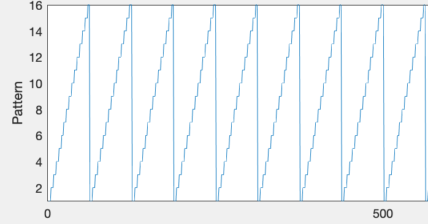

# Setting up an experiment - an overview

At this point, your hardware should be set up and working, and you should understand how to tether a fly inside the arena. If not, please see "Historic Background" and "Getting the hardware" pages under "Getting Started." 

So your hardware is set up and you're ready to run an experiment? You'll need the G4 Display Tools.

## What are the G4 Display Tools? 

The [G4 Display tools](../README.md) are a suite of software tools that make it easy to run fly behavioral experiments on the Generation 4 (G4) arena. These tools allow you to: 

- Create patterns to display on the screens
- Generate functions to control the movement of patterns on the screens
- Organize these into experiments which can be saved for later use
- Run experiments on the screens with the click of a button
- Automatically save and process data
- Perform some types of data analysis automatically

For now, here's an overview of the steps you will take to set up an experiment utilizing these tools. Please see the page for each individual tool for further details on its use and tutorials to take you through this step by step. 

The first thing you need to do is create any patterns:

and/or functions:

that will be necessary for the experiment. You don't want to create a pattern and add it to the experiment one at a time - create all your patterns and functions up front. You can do this using the  for patterns and  for functions. 

Once your patterns and functions, if you need them, have been created, you want to open the [G4 Protocol Designer](../G4_Protocol_Designer/User-Instructions.md). This software will allow you to import the patterns and functions you've created and organize them into trials. It will also allow you to set many other parameters, like the size of your screen, whether you want trials randomized, how many times the protocol should be repeated, and much  more. 

Once you have organized your trials the way you want them, the G4 Designer will also let you save the protocol. This will save a file with extension .g4p (G4 protocol) in your save location. It will also create folders which hold copies of all the patterns and functions used in the protocol. I will refer to the folder in which you have saved this protocol as the experiment folder. The experiment folder will contain everything needed to run the experiment. If you open the G4 Designer or Conductor and want to open an existing protocol, you will go to File -> Open and browse to the .g4p file. Opening the .g4p file will import everything that is needed from the folder. However, you should not move your .g4p out of the experiment folder. Leave the folder organized as is.

At this point, your experiment is set up! All that remains is to tether your fly, open the protocol in the [G4 Conductor](../G4_Protocol_Desginer/User-Instructions.md), and run it!

The G4 Conductor does require some set up before running your first experiment though, so please see its documentation section in the G4 Designer page before going any further. 

