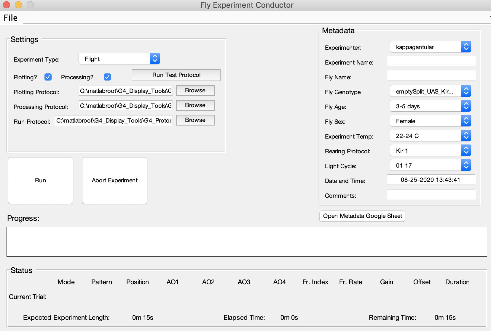
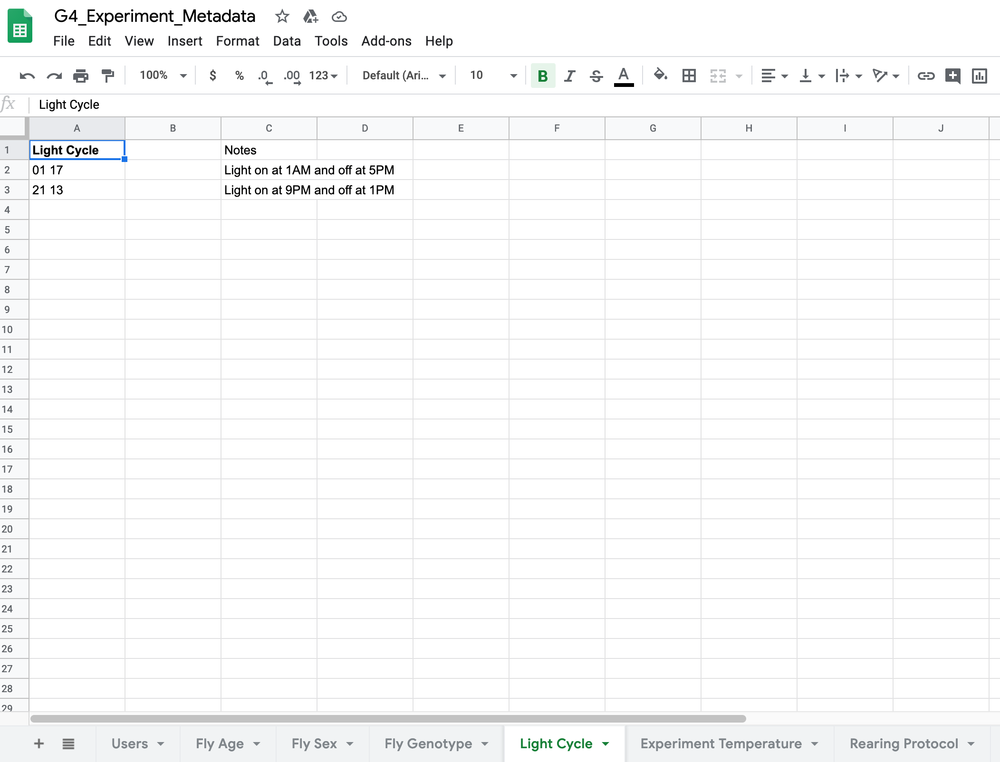

# How to run an experiment - an overview

At this point, you should understand, in broad strokes at least, what it entails to create an experiment. To learn to create an experiment in detail and access tutorials regarding the Motion Maker, Function Maker, and G4 Protocol Designer, see the [Display Tools](../README.md) page. 

Once you've created and saved an experiment, you will use the [G4 Conductor](G4_Conductor_Manual.md) to run it. 

There is one important requirement for using the G4 Conductor - you must have google sheets containing your metadata values. 

The G4 Conductor has several metadata fields at the top right that you need to set before running an experiment. They are: 

- the experimenter
- the name of the experiment being run
- the name of the fly being run
- the fly's genotype
- the fly's age
- the fly's sex
- the temperature at which the experiment is run
- the rearing protocol used for the fly
- the light cycle for the fly
- the date and time
- and any further comments

Four of these metadata fields are simple text boxes that  you can fill in or that are automatically generated: the experiment name, the fly name, the date and time, and the comments. The rest of the fields are drop down lists, and these drop down lists populate from a set of google sheets containing all possible values for each metadata field. This feature makes it easier to sort experiments by their metadata because there is no chance of misspellings or differences between users. For example, if one user put '3' in for the fly age, and another put in '3 days', and a third put in 'three days', all three experiments would not necessarily show up when you tried to pull out all experiments done on flies that were 3 days old.

There is a detailed tutorial taking you through the set up of these google sheets and how to tie them to the G4 Conductor, but here are the basics. 

Log in to a google drive account and create a new google sheet. That google sheet should have a tab for each metadata field. Here is an example taken from our google sheet.

In this example, the drop down field in the conductor will have two options for light cycle: 01 17 and 21 13. For the user's convenience, there is a button on the conductor linked to this google sheet, so if a user couldn't remember what these codes meant, they could simply click "Open googlesheet" and check in the notes. In addition, if a user needs to add a new metadata value which does not exist in the drop down lists, they can click "Open googlesheet" and add the new value directly to the sheet, so from then on it will be an option in the associated dropdown list. 

Okay, so you've made your google sheets - how do you connect them? You do this in the G4 Designer settings. Open the designer and go to File -> Settings, or you can edit the G4_Protocol_Designer_Settings.m file directly if you prefer. In the Designer settings you will see a section at the bottom called Metadata Googlesheet Properties with several GID fields. Each google sheet, and each tab within a googlesheet, has a unique ID value called its GID. You will need to get your GID values from your google sheet. To find the GID, open your googlesheet and look at the address bar. The very end of the address there should be "#gid=[some number]." That number is your GID value and there should be a different one for every tab in your google sheet. Copy and paste these GID numbers into the appropriate spots in the Designer settings, and that's it! Once you've done this once, you should never have to do it again unless you create a new google sheet. 

This is a bit inflexible right now as in there is not currently an easy way to customize or add new metadata fields, but this feature will be forthcoming in future versions.

Once the metadata is configured, using the Conductor is a breeze. If you have not automated your data processing and or data analysis using our data analysis tools, you should uncheck the boxes on the conductor labeled "Processing" and "Plotting." If these are checked, they will run automatically after an experiment and you have to provide (by browsing) the appropriate settings file you've created with our data analysis tools. But if you don't want to bother with that right now, simply uncheck the boxes. 

There is also a field for your "run protocol." This is a file that determines how exactly trials on run on the screens. There is a default run protocol provided and that will be the default path here. If you wanted to create your own custom run protocol, you will first need to learn how to use the G4_Control tool discussed under [Display Tools](../README.md).

The last thing you should be aware of is the "Run Test Protocol" button. If you click this, the conductor will load a preset, short protocol that is designed to quickly test the fly and see if they are fixating correctly. It could also be used to make sure the screens are displaying correctly. A default test protocol has been provided, but you can always create your own and make it the default in the Designer settings. You can find more details in the [G4 Protocol Designer](G4_Designer_Manual.md). 

Assuming the conductor is configured and your defaults are set, all you need to do is select your experiment type, fill in your metadata, and hit Run. A progress bar will appear, keeping you updated on which condition is running and what patterns or functions it is using (if any). After the progress bar fills, the text directly above it will read "post-processing" and eventually "Experiment Finished," at which point you can start your next experiment. If, at any point during the experiment, something goes wrong, you can click "Abort." This will save any data you have collected and stop the experiment. You can hit "Run" again to start over or get out of the program if you don't want to continue. 

This overview contained a lot of information about the Conductor, so don't forget to check out Generation 4's [Display Tools](../README.md) section for more details on how to get set up with it. 

Once an experiment is completed, the only thing left is to analyze the data, using our tools, your own, or some combination. 