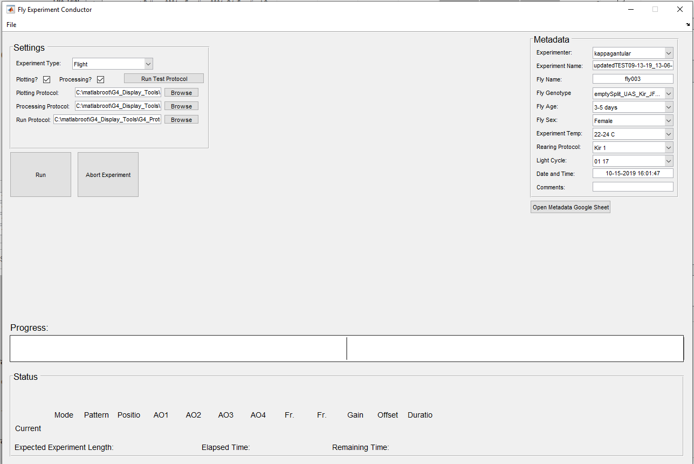

1. TOC
{:toc}

# Overview

The G4 Conductor is the application you will use to run an experimental protocol on the LED screen arena. 

To open this application directly from the G4 Designer, click the *Run Trials*{:.gui-btn} on the left side of the Desiger window. The experimental protocol that was open in the Designer will automatically be opened in the Conductor, assuming you have saved the experimental protocol. 

If the Designer is not open, there is no need to open it. You can open the file `G4_Display_Tools/G4_Protocol_Designer/G4_Experiment_Conductor.m` in matlab and hit Run to open the Conductor directly.

The window that opens should look something like this:

The top left section contains settings for your experiment. The top right section is where you can fill in some basic experiment metadata. The center displays a progress bar, or will once an experiment begins running. Once you begin running an experiment, data relating to the current trial will display along the bottom. 

*Note: You must have set up a metadata google sheet and connected it to the G4 software through the G4 Designer Settings. If you have not done this, the Conductor will not open properly. Please see the [tutorial on how to set this up](../docs/googlesheet_tutorial.md).*

# Fill out the metadata

Notice in the above picture, the metadata is already filled out for the most part. That's because possible values for these metadata fields are stored in a googlesheet created for this purpose. Most of the metadata fields have a drop down list which draws its options from this googlesheet. This prevents people from introducing typos or stating the same metadata in different ways, making it difficult to search experiments by metadata values. If the value you need for a metadata field is not present in the drop down list, you can click the *Open Metadata Google Sheet*{:.gui-btn} button at the bottom. This will open the appropriate googlesheet. You can find the tab that corresponds with the metadata field and add the value you need to the sheet. Any fields that do not have a drop down list or autofill, please fill in appropriately.

*Note: You can add comments to the comments metadata field anytime during the experiment, and when the experiment ends it will pause and give you another chance to add any final comments.*

If you are on a Windows operating system, and when you click Open Metadata Google Sheet nothing happens or you get an error that says, `'cmd.exe' is not recognized`, try running this command in the MATLAB command line once before clicking the button again: `setenv('PATH', [getenv('PATH') ';C:\Windows\system32'])`.

# Experiment settings

Next, take a look at the top left panel and fill out your experiment settings appropriately.

## Experiment type.

Select the correct experiment type. Experiment type refers to your arena set up - whether you have a fly tethered and flying, or whether you have a fly walking on a ball. 

This is important because, the Designer settings, you have a default test protocol for each experiment type. When you click the *Run Test Protocol*{:.gui-btn} button, the file associated with that experiment type in your settings will run automatically. More on the test protocol later. 

## Processing and Plotting.

Select whether you would like the application to perform automatic data processing and/or plotting when the experiment is done. 

For this to work, you should have created a data processing settings file and a data analysis settings file earlier in the experiment design process. If processing is checked, the associated filepath should be to your processing settings file, and the same for your plotting (analysis).

If you want your data processed and analyzed automatically but have not set up these settings files, please see [Data analysis](../G4_Data_Analysis/Data_analysis_documentation.md). If you do not wish to use this feature right now, simply uncheck the processing and plotting boxes. 

## Processing, Plotting, and Run Protocol paths.

You must set the paths to three files – the processing and plotting files (if you’ve selected to use them) and the run protocol file. The default paths in the settings file will be placed here automatically, so if you don’t wish to change from the defaults, you don’t have to do anything. However, you can change these without altering the defaults. Hit the *browse*{:.gui-btn} button at the end of each text box to change the file being used in this particular experiment.

- Please note that the run protocol file is set up to be edited by users if they wish. There is now only one default run protocol, but you can change it and save others if you’d like. You should always save these in `G4_Display_Tools\G4_Protocol_Designer\run_protocols` with the default. Whatever .m file is in this text box is the one that will be run. Please only do this if you are comfortable writing scripts in MATLAB.
- Please note that you cannot change the experiment name in the conductor. The designer, if it is open, and the conductor share the same underlying experiment. If you change the experiment in the designer, it will change in the conductor, but if you have opened the conductor independently, it will not. For this reason, changing the experiment name in the conductor could lead to confusion as to which is experiment is actually loaded. If you must make any changes, close the conductor and go back to the designer.

# Run a test protocol (optional)

The *Run Test Protocol*{:.gui-btn} button will run the protocol listed in the settings file as the test protocol for that type. This will allow you to see a test run on the screens and make sure it looks right. If you need to adjust these settings, you cannot presently do it from the conductor. Close the conductor, adjust the settings through *File*{:.gui-btn} -> *Settings*{:.gui-btn} on the Designer, then return the conductor when finished.

## The progress bar.

You’ll notice in the image above, the progress bar is split into two halves. A vertical bar will denote the end of each repetition. The more repetitions your experiment has, the more bars there will be. When you start running an experiment, text will appear above the progress bar, telling which trial in which repetition is running at any given time. 

## Trial Data.

Below the progress bar will be the parameters for the trial currently running on the screen. You’ll notice that the *Pattern*{:.gui-txt}, *position function*{:.gui-txt}, and *AO functions*{:.gui-txt} give numbers, not file names. This is the value being sent to the screens. If `Pattern_0008` is the fourth pattern in the patterns field of `currentExp.mat`, then the number provided under *Pattern*{:.gui-txt} will be 4. The `currentExp.mat` file stores all the experiment parameters and sends them to the screen in a way the screens can understand.

Also beneath this will be the total time the experiment is expected to take.

## Run the experiment.

When you are ready to go, hit the *Run Experiment*{:.gui-btn} button. It will take a few seconds to connect to the G4 Host, but when everything is ready, a dialog box will pop up asking you to *Start*{:.gui-btn} or *Cancel*{:.gui-btn}. If you entered a duration of zero for your pre-trial, don’t forget you will need to hit a button to make the experiment go past the pre-trial.

## Abort an experiment.

If something goes wrong and you need to abort an experiment in the middle, hit the *Abort Experiment*{:.gui-btn} button. This will finish the currently running trial, then stop the experiment. It will automatically clear out any lingering log files, so once you get the dialog box saying the experiment was aborted successfully, you can hit *Run*{:.gui-btn} to restart the experiment. 

## Open a subsequent experiment.

If you are done with the experiment currently loaded in the conductor and wish to run another, no need to close the application. Just go to *File*{:.gui-btn} – *open*{:.gui-btn} and open the new experiment. It will automatically replace the old one.

## Using the conductor without the designer.

The conductor can also be opened on its own, without going through the experiment designer. To open the conductor directly, run the `G4_Experiment_Conductor.m` file in `G4_Display_Tools\G4_Protocol_Designer`. If you open the conductor this way, then you will need to go to *File*{:.gui-btn} – *Open*{:.gui-btn} to open the .g4p file you want to run. Other than that, it operates exactly the same as described above.

# Post-experiment data analysis

## Data analysis. 

If you elected to run them, data analysis scripts will run when the experiment is complete. This will create a `Results` folder in your experiment folder. The Results folder will contain a folder for each fly that has been run through that particular experimental protocol, which is why giving your flies unique names is important! In each fly folder will be TDMS log files, a processed data file, and a PDF report containing the metadata and basic data analysis/plotting. The only plotting files which produce PDF reports are in `G4_Display_Tools\G4_Protocol_Designer\plotting_files`.  If you develop other data analysis files, simply replace the path for the processing or plotting files in the conductor, and those will run after the experiment instead. However, you cannot currently run more than one for each step.

# How to change the run protocol for experiments.

## The run protocol.

The run protocol does not refer to the .g4p file, but refers to the way in which the experiment parameters in the .g4p file are relayed to the screens. For example, in the default run protocol, no inter-trial is run before the first block trial or after the last, though an inter-trial is run between repetitions of the block trials. If you wanted to change this, you could edit the default run protocol (not recommended) or save a new run protocol with this change (recommended). Please only do this if you are comfortable writing MATLAB scripts to run experiments on the LED arena, and never delete the default run protocol. 

If you create your own run protocol, please do not forget that you must change the path in the conductor to your new file. 

The default run protocol file is heavily commented to help you understand what each piece of code goes, but if you are confused about something, you can always contact Lisa Taylor at her contact information at the bottom of this document. 