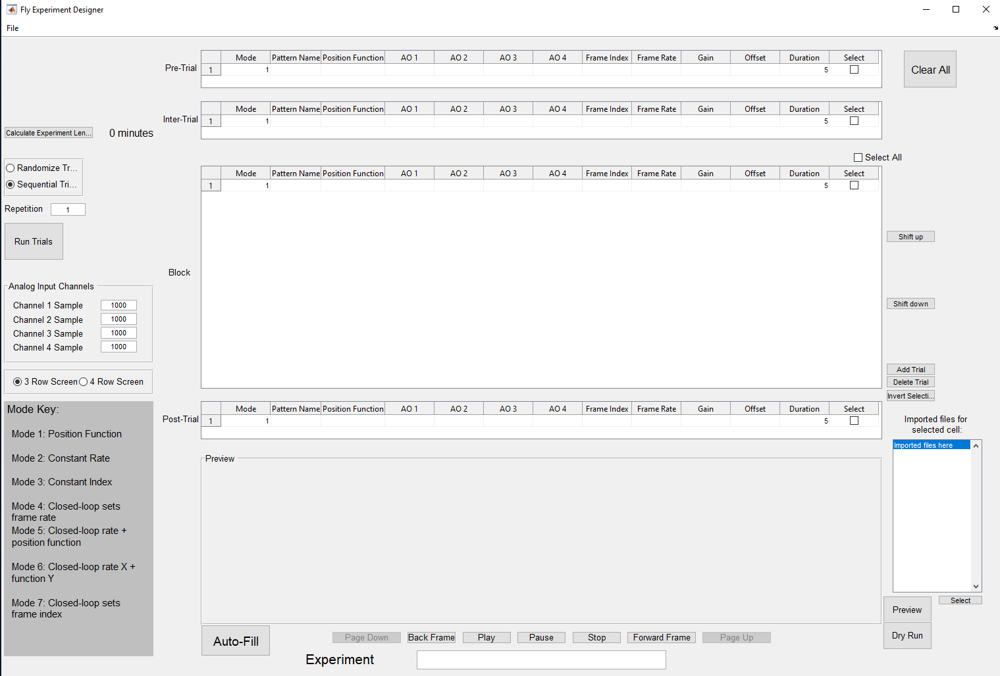
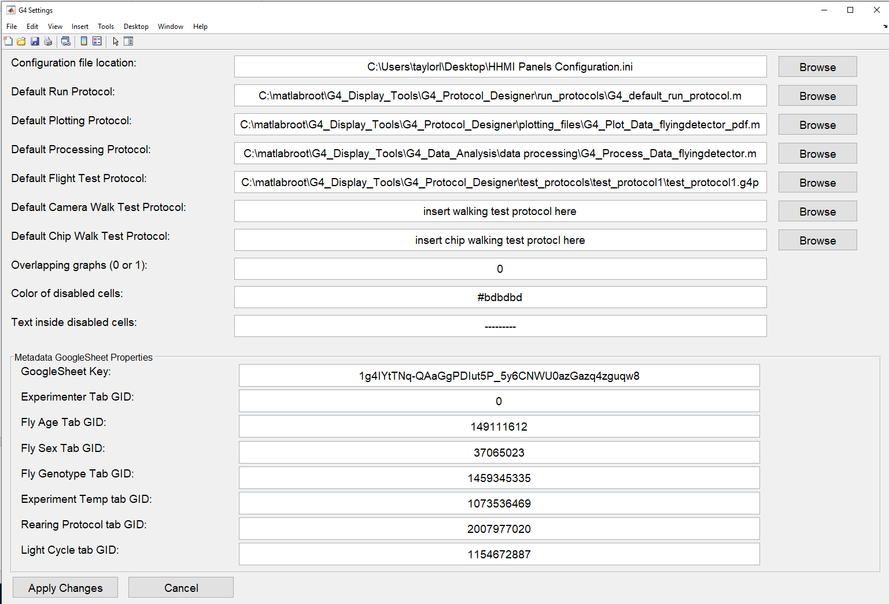
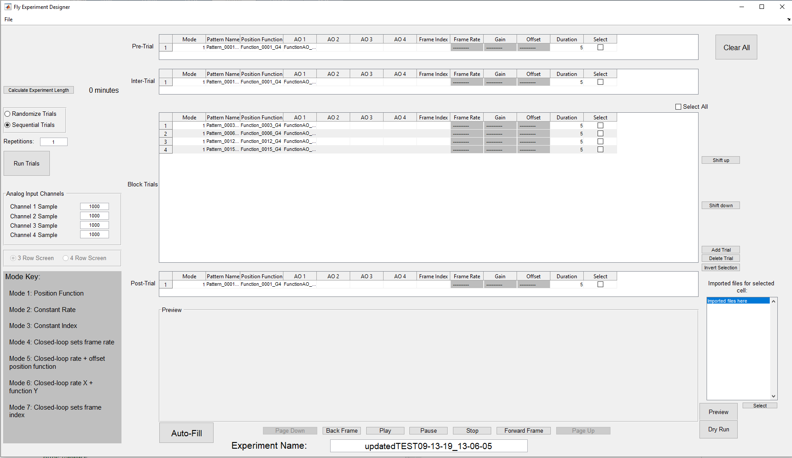
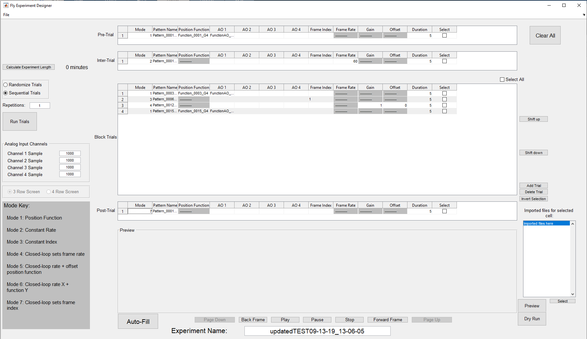
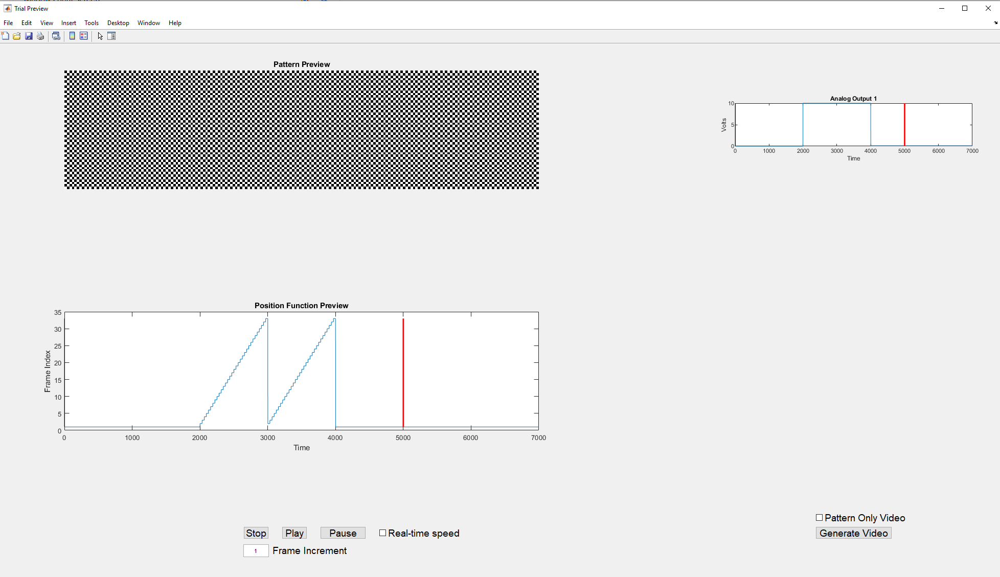

1. TOC
{:toc}

# Before you begin

Author:  [Lisa (Taylor) Ferguson](mailto:taylorl@janelia.hhmi.org)

To Install, clone or download the [G4 Display Tools github repository](https://github.com/JaneliaSciComp/G4_Display_Tools). For full functionality, you must add this folder to the MATLAB path with all its subfolders and files. To do this, click *set path*{:.gui-btn} in the MATLAB home tab, and *add with subfolders*{:.gui-btn}. Next, browse to the location where you saved G4_Display_Tools, save and close the *Set Path*{:.gui-txt} window. Alternatively, in the Current Folder pane in MATLAB, browse to the location where you saved G4_Display_Tools, right click this folder, and select *Add to Path: Selected folders and subfolders*{:.gui-btn}. 

You must also add your configuration file to your MATLAB path. It should be saved at `C:\Program Files (x86)\HHMI G4\Support Files\HHMI Panels Configuration.ini`.  If you don’t have this, please see the [Software Setup documentation](../docs/G4_Software_Setup.html).

Lastly, please ensure that `C:\matlabroot\PControl_G4_V01\TDMSReaderv2p5` is NOT on your MATLAB path. This folder contains files from previous versions of this software that may conflict with the current files. You can check this via the MATLAB command `contains(path, "TDMSReaderv2p5")` – a return value of `1` means the folder needs to be removed from your path.

Before you begin, please note that the Pattern, Position function, and AO function .mat files used by this program must be structured correctly for the program to read them. 

- Patterns, at a minimum, must be a struct named pattern with fields `pattern.Pats` and `pattern.gs_val`.
- Position Functions, at a minimum, must be a struct named pfnparam with fields `pfnparam.gs_val`, `pfnparam.func`, and `pfnparam.size`
- Ao Functions must be a struct named afnparam with fields `afnparam.func`, `afnparam.size`, and `afnparam.ID`

# Tutorials

This page constitutes the main user manual for the G4 Protocol Designer, but there are a number of additional tutorials to help you get set up. If you need more guidance, please scroll to the bottom of this page for a list of available tutorials.

# The Designer: Start-up

If you already have a .g4p file saved and ready to run, you can open The Experiment Conductor directly instead of using the designer.

## Start the protocol designer.  

In MATLAB open the file `G4_Experiment_Designer.m`, located in `G4_Display_Tools\G4_Protocol_Designer` and hit run. Alternatively, you can type `G4_Experiment_Designer` into the matlab commandline and hit enter. This should open the "Fly Experiment Designer" in a Window that looks like this:



## Check the size of the LED arena you are using. 

LED screen arenas come in three row screens and four row screens. Which patterns you can use are determined by the screen size, so be sure to check what type of arena you’re using. 

Notice the radio button at the center left of the application indicating *3 Row Screen*{:.gui-btn} or *4 Row Screen*{:.gui-btn}. Set this to the correct screen size that corresponds with your [hardware setup](../../../docs/G4-Assembly.md) before doing anything else. This setting will become disabled as soon as you import a folder, so if it is incorrect when you import, you will need to restart the application.

## Verify your settings are correct. 

The next step after verifying your screen size is to verify your settings are correct. Click *File*{:.gui-btn} > *Settings*{:.gui-btn} to open up your settings window. It should look like this:



The first field in the settings panel reads *Configuration file location:*{:.gui-txt} If the path to the configuration file is incorrect, please update it by using the associated browse button or by typing the correct path into the field.

## Run, Plotting, and Processing

The next three fields are paths to your default run protocol file, processing file, and plotting file. A default run protocol is provided with the G4 software, but if you'd like to learn exactly what the run protocol does and how to create your own, please see the tutorial [Create a Run Protocol](../docs/run_protocol_tutorial.md). 

Plotting and Processing refers to settings files dictating how you want your experimental data to be handled after the experiment. If you have not created these settings files, please see the tutorials [Set up Processing](../docs/processing_tutorial.md) and [Set up Data Analysis](../docs/analysis_tutorial.md).

Assuming you want to use the default run protocol, this field should read `G4_Display_Tools\G4_Protocol_Designer\run_protocols\G4_default_run_protocol.m`.  The other two should contain paths to your processing and data analysis settings files, or should be empty if you haven't created them. 

*Note that these are defaults. Regardless of the paths here, when it is time to run an experiment you can always choose new files.*

## Test Protocols

The next three lines in the settings window provide paths to test protocols for each type of experiment. The default test protocols are located in `G4_Display_Tools\G4_Protocol_Designer\test_protocols`. Again, you can set these to custom test protocols if you have them. You can learn more about test protocols and their purpose in the G4 Conductor documentation.

## Disabled cells

When using the protocol designer, cells for unavailable parameters will by default fill with ‘---------‘ on a grey background, to indicate that you cannot edit these cells. The next two fields in the settings file allow you to customize the color and text which fill disabled cells. 

## Metadata GoogleSheet Properties. 

Notice the separate panel at the bottom of the Settings window called Metadata GoogleSheet Properties. These keys link to an online spreadsheet from which the Conductor dynamically pulls the possible values for each metadata field. The different fields labeled with "GID" define tabs in the metadata GoogleSheet. **The G4 Conductor requires you to have such a googlesheet** to populate the metadata options when you run an experiment. If you don't have this set up, please see the [metadata googlsheet tutorial](../docs/googlesheet_tutorial.md) for assistance. 

Once you have completed the tutorial and filled in these GID values, you should not have to do it again unless you delete or create any tabs in your googlesheet. If you do this, the new keys will need to be obtained (as shown in the tutorial) for that tab and replaced here. Otherwise, set this up once, and then you can forget about it. 

# The Designer: Import files

To design an experiment, you must first import the files that you will use for the experiment. These files may include patterns, position functions, analog output functions, or the `currentExp.mat` file produced with every experiment. Patterns describe the visual output on the arena at any point in time. You can use the position functions to change this output over time. Analog output functions are used to generate a corresponding output on the BNC. You should have already created these using the [G4 Motion Maker](../Motion_Maker_G4/About Motion Maker.md) and G4 Function Maker](../Function_Maker_G4/About Function Maker.md). The file `currentExp.mat` is a description of the experiment itself.

*Note that the `currentExp.mat` file will only exist if you are importing an experiment that has already been designed and saved with the designer. If you are creating a new experiment from scratch, you won't have it. The Designer will create it for you.*

Go to *File*{:.gui-btn} -> *Import*{:.gui-btn} at the top left of the application. A box will appear giving you three options – Folder, File, or Filtered File. Select *Folder*{:.gui-btn} if you want to import all files from a particular folder. Alternatively, you can also import patterns or functions individually, one file at a time. The option *File*{:.gui-btn} allows you to choose a single file. The text you enter after selecting *Filtered File*{:.gui-btn} acts as an additional filter for the file selection dialog. For example, entering 'horizontal' or '0001' in the Filter Import Results will result in a `*horizontal*.mat` or `*0001*.mat` filter respectively. It is therefore like a permanent alternative to typing `*horizontal*.mat` as a filename in the file selector dialog.

After selecting the file or folder you wish to import and depending on the size of your import, a progress bar informs you about the import progress. Once all files have been imported, you will see a summary of imported and skipped files. Files that are not recognized as necessary for an experiment or duplicate files, for example, will be skipped when importing. It will also tell you if there were any unrecognized files and how many. Once you confirm with *OK*{:.gui-btn} the import is complete. At this point you might notice the change in the *Experiment Name*{:.gui-txt} at the bottom of the screen. If you have imported an existing experiment folder, this box will contain the experiment folder’s name. Nothing else will look much different.

# Designing an experimental protocol

## Experiment structure

Notice the layout of the four tables that make up the majority of the Designer's interface. This gives you an idea of how it expects an experiment to be structured. An experiment is simply a set of conditions that are played on the screens in a particular order. 

### Some terminology

A single line in a table is called a **condition**. The pre-trial, inter-trial, and post-trial tables only allow for one condition. The block trials table can have as many conditions as you need, and the condition number is the row number of the table. A condition consists of [the mode](../docs/experiment_modes.md), one pattern and optionally one position function and up to four analog output functions. Other parameters in the table will be editable depending on the mode of the condition. 

On the left side of the main window is a set of radio buttons that say *Randomize Trials*{:.gui-btn} and *Sequential Trials*{:.gui-btn}. A **trial** is how we refer to any condition that plays on the screen. For example, if your trials are randomized, "Trial 1" (meaning the first item played on the screen) may be condition 12. And if you are repeating an entire set of 40 conditions 4 times, then you will only have 40 conditions, but you will have 160 trials. 

It's important to know this distinction to avoid confusion, as the conductor will provide you both the trial number and condition number when running an experiment. It will also save a .mat file in your results folder once an experiment is complete called exp_order.mat which will list the order in which your conditions were run. 

**Block trials** are a set of conditions which make up the meat of your experiment. They are not dependent on one another and can vary in mode, length, and other parameters. 

The **pre-trial** is a single condition that is run at the very beginning of an experiment and then not run again. It is often a condition meant to test that the fly is responding as expected or to get the fly oriented before the real experiment begins. 

The **inter-trial** is a single condition that is played in between each block trial. It is not played before the first block trial or after the last block trial as long as you are using the default run protocol. It's often used to re-orient the fly to baseline after some condition played and elicited a behavioral response.

The **post-trial** is a single condition that is played at the very end of the experiment, after the last block trial. 

### The rest of the experiment structure 

The conditions make up the majority of your experiment. Other parameters include the randomization of block conditions, the number of times block conditions should be repeated, and sample rates for any analog input channels in use. 

## How to create conditions

This section will describe in detail how to create an experiment, but if you would like more detailed instructions or run into issues not addressed in this section, please see these tutorials on [creating a condition](../docs/condition_tutorial.md) and [creating an experiment](../docs/experiment_tutorial.md).

You can start creating conditions using the files imported in the previous step. The easiest starting point is to hit the *Auto-Fill*{:.gui-btn} button. This will create a block trial for every pattern imported, as well as create a pre-trial, inter-trial, and post-trial using the first pattern. Each trial will default to mode 1 and automatically pair a position function and one analog output function to each pattern (if they exist). Durations default to double the length of the position function. Hitting *Auto-Fill*{:.gui-btn} will produce something like this:



Notice that cells holding parameters not used in mode 1 (such as *Frame Rate*{:.gui-txt}, *Gain*{:.gui-txt}, and *Offset*{:.gui-txt}) are disabled. If you try to edit these cells you will get a warning and your change will be reset. Each mode uses different parameters so if you change the mode of a condition, the cells will automatically adjust, enabling those used in that mode and disabling the rest.

The string in the cells under *Pattern Name*{:.gui-txt}, *Position Function*{:.gui-txt}, and *AO 1*{:.gui-txt} to *AO 4*{:.gui-txt} are the names of the files of that type you have imported. If you click on one of the Pattern cells, two things will happen. You will get a preview of that pattern in the preview pane. This preview starts at frame 1, and you can use the *Play*{:.gui-btn}, *Forward Frame*{:.gui-btn}, and *Back Frame*{:.gui-txt} buttons to look at the different frames of the selected pattern.

If the small checkbox labeled "Arena preview" at the bottom right corner of the window is checked, the pattern you clicked on will also be displayed on the arena screens. This allows you to preview what that pattern will look like on the screen. As you play, move forward, or move back through the frames, the arena display will update as well. 

*Note: Please make sure this check box is not checked if your computer is not actually connected to the arena screens or if the screens are not completely set up as this could cause an error.*

The second thing that will happen is that the embedded list to the right of the preview will fill with all the imported files of that type (patterns if you’ve selected a pattern cell, position functions if you’ve selected a position function cell, and an analog output function for the AO cells). The filename of the selected cell is highlighted, but you may choose other items in this list. If you do, a preview of the item you clicked in the list will appear in the preview frame (and on the arena if enabled). You may go through this list, previewing items, until you find the one you want. Confirm a change in your currently selected cell with the *Select*{:.gui-btn} button. Clicking an empty cell will also provide this list, and you can choose the item you want and hit select to populate the empty cell.

## Other methods of arranging parameters and trials. 

Notice the buttons to the right of the block trials table. They modify the trial or trials currently selected through the checkbox at the end of each line. *Shift up*{:.gui-btn} and *Shift down*{:.gui-btn} will move your selected trial(s) up and down throughout the main block of trials. *Add trial*{:.gui-btn} will add a copy of the selected trials to the bottom of the block. If no trial is selected, the new trial is based on the last item in the block. *Delete Trial*{:.gui-btn} will remove the selected trial(s). Finally, the *Select All**{:.gui-txt} checkbox above the block will select all trials and *Invert Selection*{:.gui-btn} will uncheck all the checked trials, and check all the unchecked ones.

If you select a trial in the block, then go to *File*{:.gui-btn} > *Copy To*{:.gui-btn}, you can copy that trial into the pre-trial, inter-trial, and/or post-trial spaces. *File*{:.gui-btn} > *Set Selected*{:.gui-txt} will let you type in the values you want for each parameter in the selected trial, though this is not recommended as it's generally faster to select from the list of imported items. 

## Pre, Inter, and Post trials are not required.

If you do not wish to have a pre-trial in your experiment, simply erase the mode and hit enter. Leaving the mode blank will disable this section. The same can be done for inter-trial and post-trial, but the block trials must have at least one condition.

## Frame Index.

The frame index can be set in any mode, and will dictate where in the pattern library the animation will start. You may also enter *r*{:.gui-txt} instead of a number as the frame index. This tells the screens to start at a random frame within the frame library.

## Infinite loop pre-trial.

If you want the pre-trial to run indefinitely until you are ready to move on with the experiment, enter a duration of 0. This will cause the pre-trial to continue running until you hit a key or click the mouse to indicate the experiment should continue. This can give you time to make sure your fly is responding as it should.

Here is an example of a completed experiment. Be sure to change the name of your experiment at the bottom!



## Other parameters outside the tables.

There are a number of parameters outside the conditions themselves that need to be set.

- You may choose whether your block conditions run in sequential order or random order.
- You may choose how many times your experiment is repeated. For example, if *repetitions*{:.gui-txt} is set to 2, the pre-trial will run once, the block will run twice, with an inter-trial between each block trial, and the post-trial will run once. Note that the inter-trial does NOT run before the first block trial OR after the last block trial.
- You need to set the sample rates for your Analog Input Channels. If a channel is not in use, set its sample rate to 0.
- You must set your screen size BEFORE importing.
- You must also give your experimental protocol a name at the bottom.

# Saving and opening experiments

## Saving an experiment. 

You’ll notice that under the *File*{:.gui-btn} menu, there is no "Save" option, only *Save As*{:.gui-btn}. This is a safety precaution to prevent you from overwriting an older experimental protocol. When you hit *Save As*{:.gui-btn}, the application will immediately append a timestamp to the end of your experiment name and save the experiment in a folder of this name in whatever location you browse to. If the experiment name already has a timestamp at the end of it (if, for example, you opened an existing experiment and edited it without changing its name), that timestamp will be removed and replaced with a current one, so your old folder will not be overwritten. 

*Note that the experiment does not contain any data at this point, only a protocol defining the experiment.*

When you save an experiment, the application will automatically export all the files you need to run said experiment. It will create a folder which is named with your experiment name. This will generally be referred to as the **experiment folder**. Inside the experiment folder will be a `Patterns` Folder, `Functions` folder, and `Analog Output` folder, in addition to the `currentExp.mat` file and `.g4p` file:

```
├── Patterns
├── Functions
├── Analog Output
├─ currentExp.mat
└─ experiment.g4p
```

*Note that the Patterns folder will contain only patterns actually used in the final protocol, even if you imported more. Same goes for the Functions and AO folders.*

Once you have saved an experiment, if you want to design another one, there is no need to close the application. Simply click the *Clear All*{:.gui-btn} button at the top right corner, and it will clear out the currently loaded experiment. Be careful though, if you click *Clear All*{:.gui-btn} before saving the experiment, you will lose your work!

## Opening an experiment.

When you go to *File*{:.gui-btn} – *Open*{:.gui-btn}, you’ll see one or more options. *.g4p file*{:.gui-btn} is the first and will always be there. Click this if you want to open an experiment file not listed. When you open an experiment, you should browse to the .g4p file inside the experiment folder and open that. Everything in the folder will automatically be imported.

Below the *.g4p file*{:.gui-btn} option may be listed up to four experiment names. These are the four most recently opened .g4p files, and if you want to open one of them again, just click the name it will open automatically. When you first start using this software, there will be no recently opened files to list here, but they will appear as you use the software.

Keep in mind if you open an experiment, change it, and then resave it, it will not update the original experiment. It will save as a new folder because there will be a new timestamp added to the experiment name.

When you open an experiment, the designer will automatically populate with the appropriate trials and parameters.

# Previewing an Experiment

## Previewing a full condition.

The in-screen preview panel shows you a preview of any pattern or function you select, but you can also get a holistic preview of a selected condition. Select the box at the end of the condition you want to see and hit the *Preview*{:.gui-btn} button to the right of the preview pane. You will see a separate window pop up that looks something like this, depending on the trial:



You have some options to set once this window is open. Notice the *Real-time Speed*{:.gui-txt} checkbox below the position function, and the *Frame Increment*{:.gui-txt} field below that. If you hit *Play*{:.gui-btn} immediately after the preview window opens, when the *Frame Increment*{:.gui-txt} is set to `1`, the preview will play VERY slowly. This is because these patterns play on the arena screens at 500 or 1000 frames per second, and a frame increment of 1 means you are showing every single frame on a screen that only refreshes at approximately 20 frames per second.

If you’d like to see the preview in real-time, check the *Real-time Speed*{:.gui-txt} box by the *Pause*{:.gui-btn} button. This will automatically calculate what frame increment is needed to play the trial at its set duration. Notice that while the *Real-time Speed*{:.gui-txt} box is checked, you cannot change the *Frame Increment*{:.gui-txt}.

If you would like to see the preview at some speed in the middle (fast enough that you don’t grow old waiting for it, but slow enough to get a good idea of what is happening), uncheck the *Real-time Speed*{:.gui-txt} box and set the *Frame increment*{:.gui-txt} to any number. It determines how many frames are skipped between each frame shown, so the higher the number, the faster the playback.

A vertical bar traces the current position in the position function preview and AO function previews as the pattern plays. A red vertical bar denotes the duration set in the designer. For example, in the picture above, the position function being used has a maximum x value of 7s, but my duration for this trial is set to 5s. Therefore, the red bar marks the place on the function where play will stop. Ideally, you will look for the red vertical bar to fall at the end of your graph, indicating that the duration set in your designer matches the duration of the functions you’re using.

## Generate a video of the preview

Sometimes it would be nice to easily generate a video of what your condition will look like so you can share it easily or display it in a presentation. You can do that from the preview window.

Notice on the right side there is a check box labeled *Pattern Only Video*{:.gui-txt} and a button beneath it that says *Generate Video*{:.gui-btn}. These options let you create a video of your trial. If you hit *Generate video*{:.gui-btn} without checking pattern only, it will produce an .avi video of the preview window, played at the current frame increment speed. If you check *Pattern Only*{:.gui-txt} then the video produced will only show the pattern playing. Create different speed videos by adjusting the frame increment before clicking Generate Video.

# Dry Run

A dry run is the running of a single trial on the LED screen arena. This condition does not activate any analog input channels and does not include any pre- or post- trials. It will run the selected condition on the screens in isolation, so you can verify it appears on the arena as you expect. 

To do this, select the condition you want to view and hit the *Dry Run*{:.gui-btn} button below the *Preview*{:.gui-btn} button. Please note that this could take a few seconds, as it may need to open and connect to the G4 Host. A dialog box will pop up when the screens are ready, asking you to click *Start*{:.gui-btn} or *Cancel*{:.gui-btn}. The condition will not begin running on the screens until you click *Start*{:.gui-btn}.

# Prepare your automatic data processing and analysis

If you would like your data to be processed or have any our offered preliminary analyses done on it automatically at the end of your experiment, I would recommend you set that up when designing your experiment, so your experimental protocol is fresh in your mind. However, this process does not involve the G4 Designer and can be done at any time. 

For an overview on how this works, please see the [Data analysis overview](../docs/DAtools_overview.md) or for more specific instructions, see the [Data processing tutorial](../docs/processing_tutorial.md) and [Data analysis tutorial](../docs/analysis_tutorial.md).

# Final Details

## Additional Resources

This pretty much covers the G4 Designer's features and how to use them. However, if you still have any questions or issues, you may refer to one of the additional resources below: 

{::comment}- [This additional information about the experiment modes](../docs/experiment_modes.md)
- [This tutorial on how to set up your Designer settings](../docs/settings_tutorial.md){:/comment}
- [This tutorial on how to set up your metadata googlesheet](../docs/googlesheet_tutorial.md)
{::comment}- [This tutorial on how to create a single condition](../docs/condition_tutorial.md)
- [This tutorial on how to create a full experiment](../docs/experiment_tutorial.md)
- [This tutorial on how to use the arena without the Designer](../docs/screenTCP_tutorial.md)
- [This tutorial on how to set up automatic data processing](../docs/processing_tutorial.md)
- [This tutorial on how to set up automatic data analysis](../docs/analysis_tutorial.md){:/comment}

## Trouble-shooting

Many common errors will create a dialog box telling you there is a problem, but some of them may be vague if you are new to MATLAB or to this software. Here are some of the most error messages and what to do about them:                                                                                           

### "You must select a trial" or "Only one trial may be selected." 

Some of the functionality in the designer can only be performed on one condition at a time. If you get this error, scroll through all your trials and make sure one and only one condition is selected. 

### "You cannot edit that field in this mode."

Most modes only allow certain parameters to be changed. You are trying to edit a parameter not available for the mode. Check the mode value for that condition and make sure it is correct for what you’re trying to do. 

### "The value you've entered is not a multiple of 1000. Please double check your entry." 

This is not actually an error, and will not prevent you from doing anything. However, the Analog Input sample rates usually should be multiples of 1000, so this warning is there in case you miss a zero or otherwise typo a sample rate. 

### "None of the patterns imported match the screen size selected." 

Check the screen size at the center left of the designer. The patterns you’ve tried to import were made for a different size screen than you have selected. 

### "If you have imported from multiple locations, you must save your experiment before you can test it on the screens." 

This is also not an error, but a warning. If you have not saved your experiment yet, then the folder this application thinks of as the "experiment folder" is the last folder you imported from. If you have imported from multiple locations and try to test a trial on the screens, it may not work if it cannot find the pattern or function it needs in the last location you imported from. You can avoid this issue by saving the experiment before you dry run a trial. 

*Note: There are plans in the works to remove this limitation and allow the software to track where each imported file comes from. Look for this in future releases.*

**There are also errors that you might get in MATLAB that don’t produce a dialog box. Some common ones include: **

### "Error using fileread. Could not open file HHMI Panels Configuration.ini." 

If you get this error message regarding the configuration file or any other important file, check that the path to this file is correct in your settings and make sure the file is on your MATLAB path. If you get this error regarding the `G4_Protocol_Designer_Settings.m` file, make sure it is located in `G4_Display_Tools\G4_Protocol_Designer`. Do not move it from this location. If you get this error regarding the `recently_opened_g4p_files.m` file, please make sure it is located in `G4_Display_Tools\G4_Protocol_Designer\support_files`. DO NOT edit this file.

If everything is in the correct location, this error could mean that you as a user do not have permission to edit the file in question. Sometimes, especially if the configuration file is located in a root or program files folder, a user may not be allowed to edit those files unless their user profile is set to administrator privileges. If the user cannot edit the file, then the Designer cannot edit the file on the user's behalf. Fixing the permissions will fix the error. 

# A few DO NOTs:

**DO NOT** edit any of the files in the `support_files` folder. 

**DO NOT** move any files out of their original locations within the `G4_Display_Tools` folder (though you can save that folder wherever you like, as long as it is added to your MATLAB path)

**DO NOT** allow multiple files of the same name to be on your MATLAB path, as this can cause conflicts.

{::comment}this was copied from the original file `User_Instructions.docx`{:/comment}