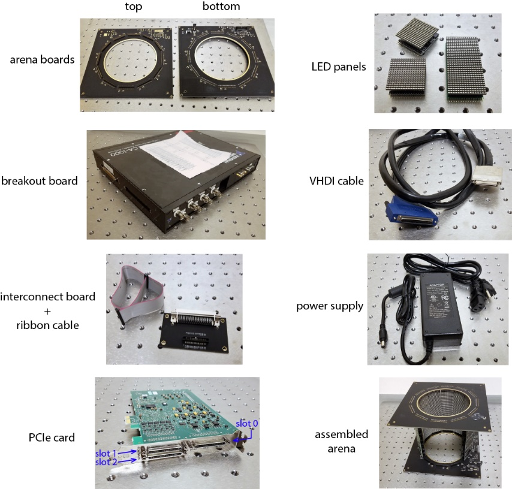
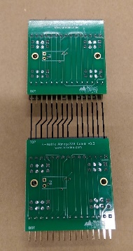

# What you need

- Windows desktop PC with a PCIe-7842R PCI card installed 
  - [Card available here](https://www.ni.com/en-us/support/model.pcie-7842.html)
  - [Recent driver](http://www.ni.com/en-us/support/downloads/drivers/download.ni-r-series-multifunction-rio.html)
- G4 arena boards (1 bottom board and 1 top board)
- LED panels, already programmed (see ‘G4_Display_Tools/G4 Panel Programming’)
- NI Breakout board (optional)
- VHDCI cable(s)
- Interconnect board with ribbon cable
- Desktop power supply (5V, 10A)
  - [Available here](https://www.adafruit.com/product/658)

# Setting up:

{: .float-right}

- Stack the LED panels into columns of the desired length and insert the columns into the G4 arena board (so that LED panel columns are sandwiched in between top and bottom boards).
  - A blank space can be created in columns of panels by using wires to connect the pins between distant rows of panels (e.g. between row 1 and 3) as shown in the picture to the right. Blank spaces can be used to point cameras or other equipment into the arena through the panel columns.
- Connect the arena to the interconnect board using the ribbon cable, and connect the interconnect board to the PCIe card (slot 1) using the VHDCI cable
- (optional) connect a breakout box to the PCIe card (slot 0) with another VHDCI cable
- Connect the power supply to the G4 arena bottom board.

{::comment}this was copied from the original file G4_Getting_Started.docx{:/comment}