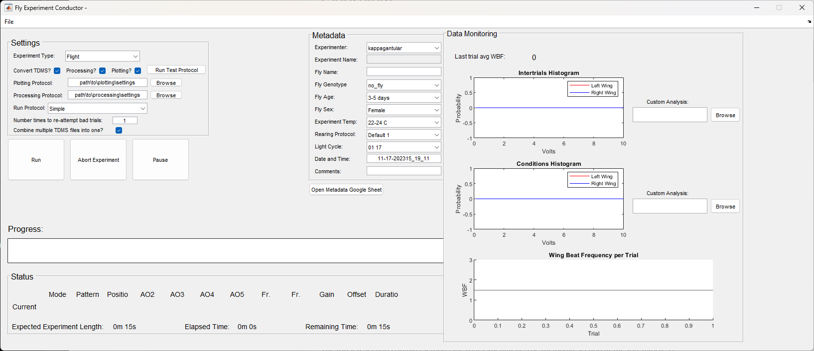

1. TOC
{:toc}

# Overview

The G4 Conductor is the application you will use to run an experimental protocol on the LED screen arena.

To open this application directly from the [G4 Designer](protocol-designer.md), click the _Run Trials_{:.gui-btn} on the left side of the Designer window. The experimental protocol that was open in the Designer will automatically be opened in the Conductor, assuming you have saved the experimental protocol.

If the Designer is not open, there is no need to open it. You can open the file `G4_Display_Tools\G4_Protocol_Designer\G4_Experiment_Conductor.m` in MATLAB and hit _Run_{:.gui-btn}, or type `G4_Experiment_Conductor` into the matlab command window and hit enter, to open the Conductor directly.

Note: If you open the file `G4_Display_Tools\G4_Protocol_Designer\G4_Experiment_Conductor.m` you may see that a number is being passed into the function `run_con = G4_conductor_controller();`. The number being passed in represents the system being used, 0 for G4 and 1 for G4-1. Currently, G4 is the default so 0 is passed into this function. If you would like to run an experiment on the G4-1 system, you'll need to either change the 0 to a 1, or erase the input all together. If no input is provided, a pop up window will ask you which system you're using before the Conductor opens. 
{:.info}

The window that opens should look something like this:

{:.pop}

The top left section contains settings for your experiment. The Metadata section at the top-middle is where you can fill in some basic experiment metadata. The center displays two progress bars, or will once an experiment begins running. Once you begin running an experiment, data relating to the current trial will display along the bottom. The right side panel, titled Data Monitoring, will display some basic data as it is collected, assuming you are using the streaming run protocol, and your experiment has streaming enabled, meaning the sample rates for the analog input channels are not set to 0 (this can be checked in the Designer). To the right of the first two axes in Data Monitoring are text boxes labeled "Custom Analysis." Advanced users may want to take the data being streamed back and run their own algorithm on the data before it is plotted. If so, they should provide the path to the function they want run on the data in these boxes. There are restrictions on custom data streaming functions, as described later on.

__Note__: You must have set up a metadata Google Sheets and connected it to the G4 software through the G4 Designer Settings. If you have not done this, the Conductor will not open properly.
{:.warning}

__Note__: The Conductor opens and utilizes the configuration .ini file. If your account does not have permission to access this file, you may get errors. Please make sure your account has permission to open and edit the .ini file before using the Designer and Conductor. (If you successfully used the Designer to create an experiment, then you have the necessary permissions).
{:.warning}

Please see the [tutorial on how to set this up](protocol-designer_metadata_tutorial.md).

# Fill out the metadata

Notice in the above picture, the metadata is already filled out for the most part. That's because possible values for these metadata fields are stored in a Google Sheets created for this purpose. Most of the metadata fields have a drop down list which draws its options from this Google Sheets. This prevents people from introducing typos or stating the same metadata in different ways, making it difficult to search experiments by metadata values. If the value you need for a metadata field is not present in the drop down list, you can click the _Open Metadata Google Sheets_{:.gui-btn} button at the bottom. This will open the appropriate Google Sheets. You can find the tab that corresponds with the metadata field and add the value you need to the sheet. Any fields that do not have a drop down list or autofill, please fill in appropriately.

__Note__: You can add comments to the comments metadata field anytime during the experiment, and when the experiment ends it will pause and give you another chance to add any final comments.
{:.info}

If you are on a Windows operating system, and when you click Open Metadata Google Sheets nothing happens or you get an error that says, `'cmd.exe' is not recognized`, try running this command in the MATLAB command window once before clicking the button again: `setenv('PATH', [getenv('PATH') ';C:\Windows\system32'])`.

# Experiment settings

Next, take a look at the top left panel and fill out your experiment settings appropriately.

## Experiment type

Select the correct experiment type. Experiment type refers to your arena set up - whether you have a fly tethered and flying, or whether you have a fly walking on a ball.

This is important because, in the Designer settings, you have a default test protocol for each experiment type. When you click the _Run Test Protocol_{:.gui-btn} button, the file associated with that experiment type in your settings will run automatically. More on the test protocol later.

## Processing and Plotting

There are three checkboxes here labeled `Convert TDMS?`, `Processing?`, and `Plotting?`. 

Data collected during the experiment is initially saved in TDMS files, which are difficult to open and work with. If `Convert TDMS?` is selected, the Conductor will automatically convert these TDMS files to a matlab file containing your raw data. This can take a few minutes, depending on the data size and which run protocol is being used. If you do not want the software to spend 1-10 minutes doing this conversion at the end of the experiment, de-select this box. The conversion can be done manually later.  

`Processing` refers to the step after converting the TDMS files to matlab files, which takes the raw data and processes it into datasets that are easier to read and visualize. If you want the Conductor to do this step automatically, you should have created a data processing settings file earlier in the design process. You'll need to provide the path to this settings file in the textbox labeled `Processing Protocol:`

`Plotting` refers to an additional step which takes your processed datasets and automatically generates some plots for you to look at. Again, this requires that a data analysis settings file was created and is provided in the textbox labeled `Plotting Protocol:`

If you want your data processed and plotted automatically but have not set up these settings files, please see [Data analysis](data-handling_analysis.md). If you do not wish to use this feature right now, simply uncheck the processing and plotting boxes.

__Note__: These steps are dependent on one another. You cannot process data that has not been converted from TDMS file to .mat file, and you cannot plot data that has not been processed. So if you select or de-select an option, any that are dependent on it will be automatically selected or de-selected appropriately.
{:.warning}

## Processing and Plotting paths

As mentioned above, if you've selected to do automatic processing and/or plotting, you must provide the path to the appropriate settings files. The default paths in the settings file will be placed here automatically, so if you don't wish to change from the defaults, you don't have to do anything. However, you can change these without altering the defaults. Hit the _browse_{:.gui-btn} button at the end of each text box to change the file being used in this particular experiment.

These paths should point to the settings files you generated for data processing and plotting earlier in the process. If you did not set up any settings for data processing or plotting, then uncheck the plotting and processing checkboxes.

__Note__: You cannot change the experiment name in the conductor. The experiment that is open in the Conductor has already been saved and changing the name in the metadata panel could cause confusion. If you need to change anything about your experiment, including the name, please do so in the Designer and re-save it.
{:.info}

## Run Protocol

The run protocol refers to an .m file which controls how exactly the .g4p file is run on the arena.  There are many run protocols provided with the G4 Display Tools, and they all have slight differences in how the experiment is run or how it is presented to the user. You should select one of the following options: 

`Simple`: This is the most basic, default run protocol. It does not stream any data back to the Conductor for the user to monitor, it logs all the data in one large Log file at the end of the experiment, and it does not use the combined command, which is a way to send all parameters for a condition to the screens simultaneously, rather than one at a time. It is sufficient for most use cases, but if your data is large and you'd like each repetition to have it's own data log, or if you'd like to get histograms of your data as the experiment runs, you'll want to choose a different run protocol.

`Streaming` is the same as the simple run protocol, except it utilizes the streaming feature. To use this feature, the experiment must have non-zero sample rates set for the Analog Input Channels. You set these values in the Designer when creating your experiment. The streaming feature does two things. First, it collects data from your fly at the end of each trial and plots it on the graphs shown in the Data Monitoring Panel (more on these in the Data Monitoring section below). This allows you to monitor how centered your fly is and how well it is flying. Second, it catches any conditions where the fly was not flying enough, marks them as bad, and attempts to re-run them at the end of the experiment. This way, if the fly successfully runs through the condition on the re-run, you still get data for that condition. The data processing will automatically use the re-run's data instead of the bad data from the first attempt.

`Log Reps Separately` is the same as the simple run protocl, except that every repetition of your experiment is logged separately. If you expect the data to be large, this can keep down the size of your Log files at the end.

`Streaming + Log Reps` is, as it sounds, a run protocol that both streams data and logs repetitions separately.

__Note__: There are other protocols listed called `Combined Command` or including `CC` in their names. These protocols send the parameters for any given condition to the screen via the combined command, which is intended to send all parameters simultaneously rather than one at a time. This command still has bugs we have not worked out, so for right now, please do NOT select these run protocols. Look for an update on this in future releases.
{:.warning}

Notice the next line in the Conductor asking how many times bad conditions should be re-attempted at the end of the experiment. By default this is set to 1. If you're using the streaming protocol, and a bad condition is re-attempted at the end of the experiment and still fails, it will not be attempted again. You can set this to a higher number, meaning if the first re-attempt fails, the condition will be tried again, up to the number of re-attempts you have set. Keep in mind that if your fly stops flying a lot, your experiment may end up being much longer than originally anticipated if you are re-running multiple trials many times at the end of the experiment. And a fly that stops flying a lot will very likely refuse to fly much at all by the end of a long experiment. Note, however, that you can also set this number to 0. If you set it to 0, you will get the benefit of seeing the fly's data throughout the experiment on the plots provided, but bad conditions will NOT be re-attempted at the end of the experiment.

## Combine TDMS files

The last line in the Settings panel asks if you'd like to combine multiple TDMS files into one. This refers to the .mat files (named G4_TDMS_Logs_timestamp.mat) that the original TDMS files are converted into. If you have de-selected the `Convert TDMS?` option above, then you should de-select this option as well. Otherwise, it is recommended that you leave this box selected.

You will end up with multiple TDMS .mat files if you are using the run protocol that creates separate logs for each repetition, OR if you use the Pause button anytime during your experiment. If you're using the protocol for separate logging, you'll end up with TDMS files for each repetition. If you use the pause button, all data collected after unpausing the experiment will be saved in a new log, since the pause button automatically halts logging. The Conductor can automatically take the converted TDMS .mat files and stitch them together into one file called G4_TDMS_Logs_Final.mat. This file does not replace the separate log files, they'll still be accessible as well. This must be done if you want to use the automatic data processing and analysis tools, but if you are using your own code to process the raw data, then you could de-select this option and skip the step of combining your separate log files into one. 

## Run a test protocol (optional)

The _Run Test Protocol_{:.gui-btn} button will run the protocol listed in the settings file as the test protocol for that type. This will allow you to see a test run on the screens and make sure it looks right. If you need to adjust these settings, you cannot presently do it from the conductor. Close the conductor, adjust the settings through _File_{:.gui-btn} → _Settings_{:.gui-btn} on the Designer, then return to the conductor when finished.

# The progress bar

You'll notice in the image above, there is a long empty rectangle followed by a shorter one under the label `Progress:`. When you open an experiment, vertical lines will appear in the longer box denoting the end of each repetition in the protocol. The more repetitions your experiment has, the more vertical lines there will be. When you start running an experiment, text will appear above the progress bar, telling which trial in which repetition is running at any given time. A horizontal bar will move from left to right, giving you a visual representation of how far along you are in the experiment. If data streaming is enabled, any time a trial is marked as bad because the fly was not flying, a red vertical line will appear on the progress bar indicating where in the experiment it happened. If your fly gets tired and stops flying a lot, you'll see this visually by the clustering of red vertical lines. If data streaming is not enabled, you'll get no indication of how the trials are going.

If data streaming is enabled, you have the option to repeat conditions that were marked as bad at the end of the experiment, as described above. If this is enabled, the second progress bar will activate when the rescheduled conditions start running. The second progress bar will show your progress through the rescheduled conditions and will also display red vertical lines anytime a condition is marked bad.

# Trial Data

Below the progress bar will be the parameters for the trial currently running on the screen. You'll notice that the _Pattern_{:.gui-txt}, _position function_{:.gui-txt}, and _AO functions_{:.gui-txt} give numbers, not file names. This is the value being sent to the screens. If `Pattern_0008` is the fourth pattern in the patterns field of `currentExp.mat`, then the number provided under _Pattern_{:.gui-txt} will be 4. The `currentExp.mat` file stores all the experiment parameters and sends them to the screen in a way the screens can understand.

Also beneath this will be the total time the experiment is expected to take.

# Data Monitoring

In the Data Monitoring Panel you'll find three plots as well as some labels. _Last trial avg WBF:_{:.gui-txt} will display, at the end of each trial, your fly's average wing beat frequency for that trial. Note that the items in the Data Monitoring panel will only update if you are using a run protocol with `Streaming` in its name.

There are three axes visible in this panel.

## Intertrials Histogram

Assuming your experiment includes an intertrial, this axis will plot a histogram of the fly's intertrial data. The histogram will be updated at the end of every intertrial, taking into account all intertrials up to that point. After a few intertrials, the histogram should settle into a pattern which will help the user understand at a glance how well-centered their fly is.

To the right of this axis is a textbox and browse button labeled _Custom Analysis_{:.gui-txt}. It's possible a user might want to plot their inter-trial data in some other way than the default histogram generated by the Conductor. If so, users are able to write their own functions which take in the streamed data, perform a function on it, and return it for plotting. They would browse to that function here, putting the path to the function in the text box. Make sure your function (and any it relies on) are on the matlab path and do not have a filename which conflicts with any of the many functions in G4_Display_Tools.

There are certain restrictions on a custom function as described above.

1. The function must take in one variable. This variable will contain the data that has been streamed back from the arena during the previous condition. It is a cell array arranged as follows:\\
`data{1}` = data collected from channel 1 (LmR data in the case of our lab).\\
`data{2}` = data collected from channel 2 (Left wing data)\\
`data{3}` = data collected from channel 3 (Right wing data)\\
`data{4}` = data collected from channel 4 (WBF data)

Each of data's cell elements are a 1×n array of floats.

2. The function must return two variables - the data you want plotted for the left wing, and the data you want plotted for the right wing. Each axis already has a line object defined for the left wing and right wing. When they're updated, all that happens is that the line's `ydata` property is updated to match the current data. Your function must provide an array of numbers for each wing that will work as the ydata of a line (meaning in must be 1 by some number in dimension).

3. The more complex an analysis function like this is, the more likely it is to slow down the entire system. The experiment will continue running while this analysis on the streamed data is done, but be cautious not to use more memory than necessary. The more functions running at once, the more likely it is to introduce glitches or slow down the software.

Note that the Custom Analysis box next to the Conditions Histogram is for the exact same purpose as this, only the data returned from any function there will be plotted on the Conditions axis instead of the Intertrials axis. The restrictions are the same for both. There is not currently any way to display custom analyzed data on the Wing Beat Frequency axis.

## Conditions Histogram

This histogram may or may not be useful depending on the experiment. It does the same as the intertrials histogram, but instead uses condition data. Every time a condition completes, this histogram will update, using all data collected from conditions so far.

## Wing Beat Frequency per Trial

This axis will update after every trial aside from the pre- and post-trials if they are present. A dot will appear showing the average wing beat frequency for that trial. Intertrials will be marked in red, regular conditions in black. A horizontal line is also plotted, indicating the minimum acceptable wing beat frequency a fly should have before a condition is marked as "bad." This limit will be taken from your data processing settings, if you have created them. If you have not, it will default to 1.5 hz.

A trial is also marked as bad if the average is above the minimum but the fly spends too large a percentage of the trial flying below the minimum wingbeat frequency (WBF). These settings are also in your processing settings file if you have created one. See [Data analysis](data-handling_analysis.md) for information on how to set up this file. If you do not doing automatic data processing, then by default a trial will be marked as bad if the fly spends 25% or more of the trial flying below the minimum wing beat frequency.

When a trial is marked as bad, a red line will appear on the progress bar to give you a visual indication of where in the experiment it happened. This way it will be visually obvious if your fly is not flying well and you're losing a lot data because of it.

# Running the experiment

When you are ready to go, hit the _Run Experiment_{:.gui-btn} button. It will take a few seconds to connect to the G4 Host, but when everything is ready, a dialog box will pop up asking you to _Start_{:.gui-btn} or _Cancel_{:.gui-btn}. If you entered a duration of zero for your pre-trial, don't forget you will need to hit a button to make the experiment go past the pre-trial.

## Abort an experiment

If something goes wrong and you need to abort an experiment in the middle, hit the _Abort Experiment_{:.gui-btn} button. This will finish the currently running trial, then stop the experiment. It will automatically clear out any lingering log files, so once you get the dialog box saying the experiment was aborted successfully, you can hit _Run_{:.gui-btn} to restart the experiment.

## Pause an experiment

If for any reason you'd like to pause your experiment for a short time without losing the data you've collected or having to start over, you can hit the _Pause_{:.gui-btn} button. This will stop the experiment as soon as the current trial is finished running. To un-pause the experiment and continue as normal, press _Pause_{:.gui-btn} again. Pausing the experiment will halt all logging and streaming and save the current log file with the experiment data so far. This means when you start up again, all data from that point forward will be collected in a new log file, and at the end you'll end up with two different log files (or more if you pause multiple times). If the option to combine tdms files is selected, these will automatically be stitched back together into one log file at the end.

## End an experiment early

If you'd like to end an experiment, but save and process the data you collected, rather than tossing it into the aborted experiments folder unanalyzed, use the _End Experiment_{.gui-btn} button. When you click this button, the Conductor will finish whatever condition is currently running and then end the experiment. As usual when an experiment is over, it will allow you a chance to add any comments to the metadata, and then it will process the data collected according to your settings. The data collected will obviously be shorter than the data analysis is expecting, so you may get a warning or two in the matlab command window about data size, but all processing should work as normal. Data for conditions that were not performed in a repetition will be set to NaN. 

## Open a subsequent experiment

If you are done with the experiment currently loaded in the conductor and wish to run another, no need to close the application. Just go to _File_{:.gui-btn} – _open_{:.gui-btn} and open the new experiment. It will automatically replace the old one. If you want to run the same protocol again, but on a new fly, there is no need to open the protocol again, but do remember to change the fly name and any other necessary information in the metadata before starting the next run. 

## Using the conductor without the designer

The conductor can also be opened on its own, without going through the experiment designer. To open the conductor directly, run the `G4_Experiment_Conductor.m` file in `G4_Display_Tools\G4_Protocol_Designer`, or type `G4_Experiment_Conductor` in the matlab command window and hit enter. If you open the conductor this way, then you will need to go to _File_{:.gui-btn} – _Open_{:.gui-btn} to open the .g4p file you want to run. Other than that, it operates exactly the same as described above.

# Post-experiment data analysis

Once the experiment finishes running, you'll find a folder inside your experiment folder with the current date as its name (ie 11_21_2023). In this folder will be a subfolder for every fly that has been run on that date. Each fly folder will, at a minimum, have one or more TDMS files, and .mat files containing your metadata for that fly and the order in which conditions were run. 

## Data analysis

If you elected to run them, TDMS conversion, data processing, and plotting scripts will run when the experiment is complete. These will leave additional files in the fly folder described above, including the converted TDMS .mat file(s), a processed data file containing multiple named datasets generated from your raw data, and plots with a final .pdf report containing all generated plots.
