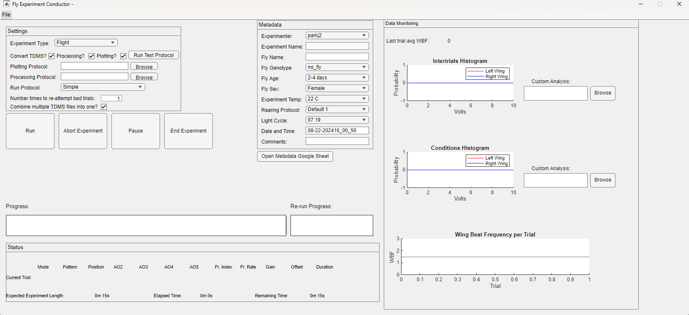

# How to run an experiment - an overview

At this point, you should understand, in broad strokes at least, what it entails to [create an experiment](experiment-conductor_getting-started.md). To learn to create an experiment in detail and access tutorials regarding the [Pattern Generator](pattern-generator.md), [Function Generator](function-generator.md), and [G4 Protocol Designer](protocol-designer.md), open the item [Generation 4]({{site.baseurl}}/G4/) on the left hand menu.

Once you've created and saved an experiment, you will use the [G4 Conductor](experiment-conductor.md) to run it.

{:.pop}

There is one important requirement for using the [G4 Conductor](experiment-conductor.md) - you must have [Google Sheets containing your metadata](protocol-designer_metadata_tutorial.md) values.

The G4 Conductor has several metadata fields that you need to set before running an experiment. They are:

- the experimenter
- the name of the experiment being run
- the name of the fly being run
- the fly's genotype
- the fly's age
- the fly's sex
- the temperature at which the experiment is run
- the rearing protocol used for the fly
- the light cycle for the fly
- the date and time
- and any further comments

Four of these metadata fields are simple text boxes that you can fill in or that are automatically generated: the experiment name, the fly name, the date and time, and the comments. The rest of the fields are drop down lists, and these drop down lists populate from a google sheet containing all possible values for each metadata field. This feature makes it easier to sort experiments by their metadata because there is no chance of misspellings or differences between users. For example, if one user put '3' in for the fly age, and another put in '3 days', and a third put in 'three days', all three experiments would not necessarily show up when you tried to pull out all experiments done on flies that were 3 days old.

Please see the [Google Sheets set-up tutorial](protocol-designer_metadata_tutorial.md) for a detailed walk-through on how to set this up, or read on for a brief overview.

Log in to a Google Drive account and create new Google Sheets. These Google Sheets should have a tab for each metadata field. Here is an example taken from our Google Sheets.

{:.pop}

In this example, the drop down field in the conductor will have two options for light cycle: _01 17_{:.gui-txt} and _21 13_{:.gui-txt}. For the user's convenience, there is a button on the conductor linked to this Google Sheets, so if a user couldn't remember what these codes meant, they could simply click _Open Google Sheets_{:.gui-btn} and check in the notes. In addition, if a user needs to add a new metadata value which does not exist in the drop down lists, they can click _Open Google Sheets_{:gui-btn} and add the new value directly to the sheet, so from then on it will be an option in the associated dropdown list.

Okay, so you've made your Google Sheets - how do you connect them? You do this in the G4 Designer settings. Open the designer and go to _File_{:.gui-btn} → _Settings_{:.gui-btn}, or you can edit the `G4_Protocol_Designer_Settings.m` file directly if you prefer. In the Designer settings you will see a section at the bottom called Metadata Google Sheets Properties with several GID fields. Each set of Google sheets, and each tab within a set of Google Sheets, has a unique ID value called its GID. You will need to get your GID values from your Google Sheets. To find the GID, open your Google Sheets and look at the address bar. The very end of the address there should be `#gid=[some number]`. That number is your GID value and there should be a different one for every tab in your Google Sheets. Copy and paste these GID numbers into the appropriate spots in the Protocol Designer settings, and that's it! Once you've done this once, you should never have to do it again unless you create a new Google Sheets.

Once the metadata is configured, using the Conductor is a breeze. If you have not automated your data processing and or data analysis using our data analysis tools, you should uncheck the boxes on the conductor labeled _Processing_{:.gui-txt} and _Plotting_{:.gui-txt}. If these are checked, they will run automatically after an experiment and you have to provide (by browsing) the appropriate settings file you've created with our data analysis tools. But if you don't want to bother with that right now, simply uncheck the boxes.

There is also a field for your _run protocol_{:.gui-txt}. This is a file that determines how exactly trials on run on the screens. There are two possible default run protocols provided by default: `G4_default_run_protocol.m` and `G4_default_run_protocol_streaming.m`, both located in `G4_Display_Tools\G4_Protocol_Designer\run_protocols`. If you'd like data collected and plotted in the axes along the right side throughout the experiment for monitoring, you should use the streaming protocol. Otherwise, use the regular one. If you wanted to create your own custom run protocol, check out the [Custom Run Protocol tutorial](experiment-conductor_run-protocol_tutorial.md).

The last thing you should be aware of is the _Run Test Protocol_{:.gui-btn} button. If you click this, the conductor will load a preset, short protocol that is designed to quickly test the fly and see if they are fixating correctly. It could also be used to make sure the screens are displaying correctly. A default test protocol has been provided, but you can always create your own and make it the default in the Designer settings. You can find more details in the [G4 Protocol Designer](protocol-designer.md) or in the [Designer Settings tutorial](protocol-designer_configure-settings_tutorial.md).

Assuming the conductor is configured and your defaults are set, all you need to do is open an experiment (if you did not open the Conductor directly from the Designer window) select your experiment type, fill in your metadata, and hit Run. A progress bar will appear, keeping you updated on which condition is running and what patterns or functions it is using (if any). After the progress bar fills, the text directly above it will read _post-processing_{:.gui-txt} and eventually _Experiment Finished_{:.gui-txt}" at which point you can start your next experiment. If you're using the streaming run protocol, the graphs on the right will update after each condition. If, at any point during the experiment, something goes wrong, you can click _Abort_{:.gui-btn}. This will save any data you have collected and stop the experiment. You can hit _Run_{:.gui-btn} again to start over or get out of the program if you don't want to continue.

This overview contained a lot of information about the Conductor, so don't forget to check out the [G4 Conductor Manual](experiment-conductor.md) for in depth instructions on its use.

Once an experiment is completed, the only thing left is to [analyze the data](data-handling_getting-started.md), using our tools, your own, or some combination.

# Running an Experiment without the Conductor GUI

It is possible to use the Conductor to run an experiment on the screens without every opening it on your screen. The visual aspect of the Conductor is for the user's convenience, but is not necessary. You may prefer to run an experiment programmatically, especially if you build other software that you want to be able to run an experiment automatically without your assistance. 

Open the file `G4_Display_Tools\G4_Protocol_Designer\support_files\create_metadata_woGUI.m`. This is a function that returns the variables you need in order to run an experiment programmatically - the filepath to the experiment, a structure with all the metadata information, and a boolean representing whether you want the test protocol run before the actual experiment. 

At line 41, set the variable `filepath` equal to the full path to the .g4p file you'd like to run. If you haven't created an experiment, you can use one of our test protocols, found at `G4_Display_Tools\G4_Protocol_Designer\test_protocols`. Make sure it is the full path including the .g4p file. Line 42 sets the `run_test` variable. It is 0 (no test) by default, but if you have a test protocol you'd like run before your regular experiment, you can set it to 1. Remember from the [settings tutorial](protocol-designer_configure-settings_tutorial.md) that the path to your test protocol is in your settings. If this is not set up, you should leave `run_test` set to 0 until you update the settings with the test protocol's path. 

Starting at line 44, the metadata structure is created. You can leave this with the default settings assuming you are just testing out the feature, but when you're ready to run a real experiment, you'll need to fill out the metadata correctly. These metadata fields are exactly the same as the ones used in the Conductor above. Just like with the Conductor, they are pulled from the google sheet. So, for example, when setting the `genotype`, you can set it equal to a number instead of a string, that number being the index of the genotype you want in the googlesheet. So if you want the third genotype listed in the google sheet, you'd set it to 3. You can also define the metadata variables using their actual string names, but you'll need to make sure what you enter here matches exactly what is in the google sheet. The comments in the first 37 lines of create_metadata_woGUI.m go through the metadata options in detail, and how to set them. 

Once you've finished editing the information in this file to match your experiment, save the file, and then write this code in the matlab command line. 

```matlab
[filepath, md, run_test] =  create_metadata_woGUI;
run_experiment_woGUI(filepath, md, run_test);
```

This will run the protocol on the arena without ever opening the GUI. If you wanted your own software to be able to do this automatically, you'd need to write a function to update the metadata, filepath, and run_test variables for each experiment. 

__Note__ When using the GUI, after a test protocol is run, a pop up asks the user if they'd like to repeat the run protocol, which they might want to do if their fly did not fixate correctly. This will not happen if you're running the experiment without the GUI. The test protocol will run once, if you choose that option, but the code which asks the user if they'd like a repeat is commented out in `run_experiment_woGUI.m`. See lines 144 to 152. If  you wanted software that is running experiments programmatically to be able to decide if and when to repeat a test protocol, you'd need to write a function the software can use to determine if the run protocol needs to be repeated, then replace line 144 with a call to your function. Then uncomment lines 149 to 152.
{:.info}
