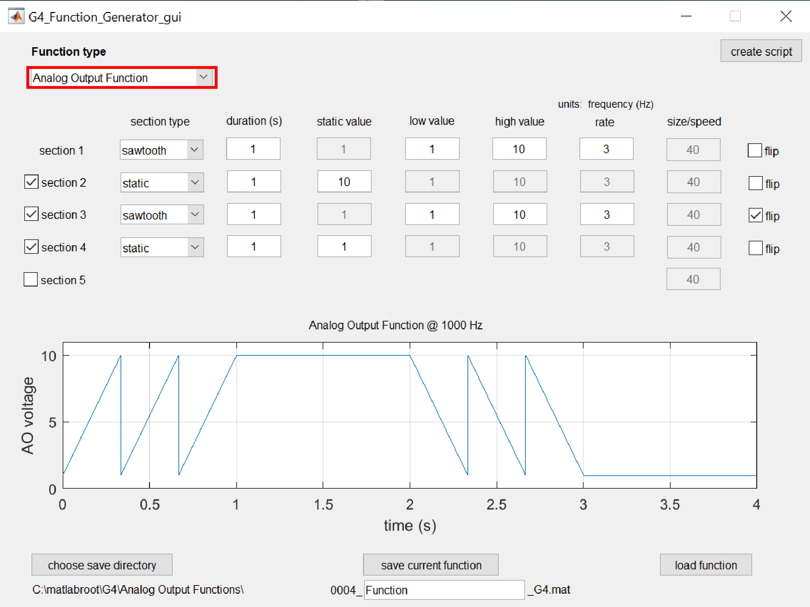

# Introduction

In this tutorial, one position function and one analog ouput function will be generated using the G4 Function Generator GUI. It is recommended to first complete the [Pattern Generator tutorial](../docs/pattern_generator_tutorial.md) as this tutorial will be most helpful as a follow-up. Additionally, it is recommended to read the [About Function Generator](About_Function_Generator.md) document; this will provide both a broad overview of how this tool works as well as a reference for all the details and functionality of the tool that aren't covered in this tutorial. This tutorial will focus on using the GUI to generate functions, though as with the Pattern Generator, this tool can also be utilized from MATLAB scripts and the MATLAB command window, as demonstrated at the [end of this tutorial](#script).

Following this tutorial, once both patterns and functions have been created, continue with creating and running experiment by either using the [provided example scripts](https://github.com/JaneliaSciComp/G4_Display_Tools/tree/master/G4_Example_Experiment_Scripts) or the [Protocol Designer GUI](G4_Designer_Manual.md).

# Setting Up

In MATLAB, type `G4_Function_Generator_gui` to begin designing your functions. When the GUI opens, it will display a default position function with many editable fields.

{:.pop}

This GUI can be used to create both position functions, which control how and when frames of a pattern are displayed, as well as analog output functions, which control output voltage signals to control and synchronize external equipment to the display. The type of function being created can be set using the *Function type*{:.gui-txt} dropdown box on the top-left corner of the GUI. In this tutorial, we will create one of each function type. The position function and analog output function to be created are described below:

1. [A position function](#pfunction) which begins by cycling forward through every frame of a 24-frame pattern at a rate of 3 Hz before pausing at the last frame, then cycling backward through the pattern at the same rate before pausing at the first frame.
2. [An analog output function](#aofunction) to be associated with the previous position function, which outputs a HIGH (5 V) signal when the pattern's frames are being cycled through (i.e. when the pattern is moving) and a LOW (0 V) signal when the pattern is held still.

# Generating a Position Function
{:#pfunction}

The default function settings display a position function which cycles forward (increasing frame number) through a 24-frame pattern at a rate of 3 Hz for 1 second. This is the correct beginning section of our desired position function, but there is more to add. Next, we'll add a pause on the last frame by enabling *section 2*{:.gui-txt} and using the *static*{:.gui-txt} option under *section type*{:.gui-txt} - this holds the pattern on a static frame for a set duration. Change *static value*{:.gui-txt} to *24*{:.gui-txt} so that the pattern is held on the last frame.

Next, we want to have the function cycle backward through the pattern in the next secion (*section 3*{:.gui-txt}). This can be achieved by enabling the *flip*{:.gui-txt} option which flips all values in that section between the *low value*{:.gui-txt} and *high value*{:.gui-txt} fields. Change section 3's *section type*{:.gui-txt} to *sawtooth*{:.gui-txt} and set the *rate*{:.gui-txt} to *3*{:.gui-txt} (Hz). Now we can see that section 3 is matches section 1, but cycles backward through the pattern.

For our final section, we'll again hold the pattern static but this time on the 1st frame. Enable *section 4*{:.gui-txt} and we're finished, as the default settings do exactly what we want.

{:.pop}

Now that the function has been designed, we need to save it in the appropriate file structure so it can be added to experiments and used for displaying patterns on the arena. Verify the save directory and function name and click on the *save current function*{:.gui-btn} button. If you want to visualize the function saved in this file later, use the *load function*{:.gui-btn} button.

# Generating an Analog Output Function
{:#aofunction}

The process for generating an analog output function is nearly the same as that for a position function, the primary difference being that the values in the function (the y-axis values in the graph) represent voltages rather than frames of the pattern. On the top-left of the GUI, select *Analog Output Function*{:.gui-txt} for the *Function type*{:.gui-txt} to start designing this function. 

{:.pop}

To start, we want to output a 5 V signal whenever the position function is cycling through pattern frames, and 0 V elsewhere. That means, we want to output 5 V during seconds 0-1 and 2-3, and 0 V during seconds 1-2 and 3-4. This can be achieved with 4 static sections.

Change all 4 enabled *section type*{:.gui-txt} fields to *static*{:.gui-txt} and uncheck the *flip*{:.gui-txt} option for section 3 as it is no longer needed. For the *static value*{:.gui-txt} fields, set sections 1 and 3 to *5*{:.gui-txt} and sections 2 and 4 to *0*{:.gui-txt}. And with that, the function is finished and can be saved with the *save current function*{:.gui-btn} button.

{:.pop}

The section-based approach used by this tool allows for many different functions to be generated easily; however, the GUI is currently limited to a maximum of 5 sections per function. If more than 5 sections are needed, the tool must be used in script form, which allows for an arbitrary number of sections.

# Generate Functions with a Script (optional)
{:#script}

As with the Pattern Generator tool, the Function Generator can also be utilized from Matlab scripts and the command window. To see how the current analog output function can be generated using a script, click on the *create script*{:.gui-btn} button on the top-right section of the GUI. This will generate and open a new MATLAB script that is written to design and generate a function with the current parameters in the GUI. Similarly, to see how this tool can be used in script form to create a position function, select *Position Function*{:.gui-txt} from the *Function type*{:.gui-txt} dropdown and click the *create script*{:.gui-btn} button again.

The primary elements to using the tool in script form is setting all of the function parameters into single struct and  passing that struct into the *G4_Function_Generator()*{:.gui-txt} function. For functions with multiple sections, each parameter should be defined as a vector of values with one value for each section, as is shown in the example script created above. After the function is generated, it can be saved using the *save_function_G4()*{:.gui-txt}.

# Next Steps

Once patterns and functions have been generated, you are ready to progress to creating and running an actual experiment. This can be achieved using the [provided example scripts](https://github.com/JaneliaSciComp/G4_Display_Tools/tree/master/G4_Example_Experiment_Scripts) or by using the [Protocol Designer GUI](G4_Designer_Manual.md).
