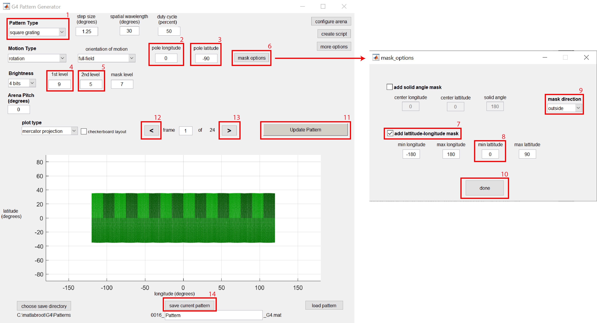
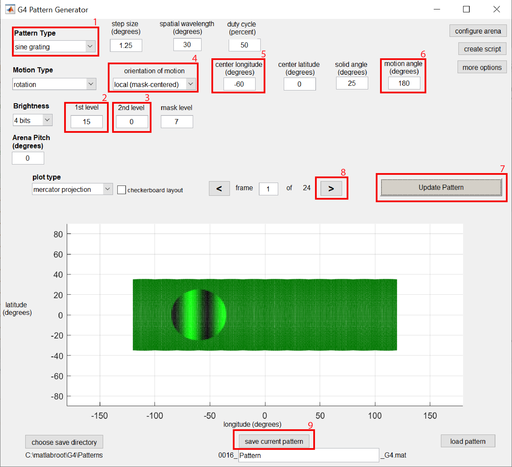

# Introduction

In this tutorial, two patterns will be generated for an experiment using the G4 Pattern Generator GUI. Before continuing, it is recommended that you first read the [About Pattern Generator](About_Pattern_Generator.md) document; this will provide both a broad overview of how this tool works as well as a reference for all the details and functionality that aren't covered in this tutorial. This tutorial will focus on using the GUI to generate patterns, though this tool can also accessed from Matlab scripts and the Matlab command window, which will be demonstrated [at the end of this tutorial](#script). The patterns generated will be designed for one of the standard G4 arena formats - an open cylinder of 12 columns of panels (which would have a circumference of 18 panels if fully enclosed) sometimes called ["12-18 arena"](../../Arena/docs/arena.md#12-18-arena-board) - though the same process can be followed for any size and shape of display.

Following this tutorial, it is recommended to read the [Function Generator readme](About_Function_Generator.md) and complete the associated tutorial. Once patterns and functions have been created, continue with creating and running experiment by either following the [provided example scripts](https://github.com/JaneliaSciComp/G4_Display_Tools/tree/master/G4_Example_Experiment_Scripts) or by using the [Protocol Designer GUI](G4_Designer_Manual.md).

# Setting Up

In Matlab, type `G4_Pattern_Generator_gui` to begin designing your patterns. When the GUI opens, it will display a default pattern and G4 display with many editable fields.

Before continuing, verify that the current display matches your own arena by clicking on the *configure arena*{:.gui-btn} button on the top right. This will open a separate GUI allowing you to define the specific size, layout, and orientation of the display in your experimental setup. In particular, check that the number of rows and columns of LED panels (as well as the size of each panel, measured by the number of pixels wide) match your display. If the observer of the display is not located directly in the center of the display (both radially and vertically), use the *rotations*{:.gui-txt} and *translations*{:.gui-txt} fields to shift the display's position to match it's actual physical placement. Once you have verified that the display matches your current setup, click the *create arena*{:.gui-btn} button to return to the Pattern Generator. The arena you have just created will now be the default display that is loaded every time the Pattern Generator is used.

Now that the display has been configured, we are ready to create some patterns. These are descriptions of the two experiment-ready patterns that will be generated in this tutorial:

1. [A low contrast square-wave grating](#pattern1) that simulates a rotation around the z-axis, but that only presents this motion above the "horizon" from the observer's perspective -- as if the observer is rotating in place on the ground.
2. [A high-contrast sine-wave grating](#pattern2) that is presented locally to a specific spot of the visual field, presenting a leftward motion on the left side of the observer's visual field.

# Generating Pattern 1
{:#pattern1}

The default pattern settings already show a square-wave grating pattern (*Pattern Type*{:.gui-txt} is *square grating*{:.gui-txt}) that rotates around the z axis (*pole longitude*{:.gui-txt} is *0*{:.gui-txt} and *pole latitude*{:.gui-txt} is *-90*{:.gui-txt}), but there are a few changes we need to make to create pattern 1. First, to make the grating pattern have a lower contrast, we'll adjust the brightness of the bright and dark bars by adjusting levels 1 and 2. Setting the *1st level*{:.gui-txt} (the bright bar) to *9*{:.gui-txt} and the *2nd level*{:.gui-txt} (the dark bar) to *5*{:.gui-txt} reduces the pattern's contrast. After editing those fields, click on the *Update Pattern*{:.gui-btn} button to visualize the change made.

To make the pattern only show the moving gratings above the observer's horizon, we can create a mask using the *mask options*{:.gui-btn} button. Checking the *add latitude-longitude mask*{:.gui-txt} and setting *min latitude*{:.gui-txt} to *0*{:.gui-txt} (with the default *mask direction*{:.gui-txt} as *outside*{:.gui-txt} setting) will mask the pattern below a longitude of 0 (i.e. below the observer's horizon). Click *done*{:.gui-btn} and *Update Pattern*{:.gui-btn} to see this change take effect; the brightness of the masked area is set by the *mask level*{:.gui-txt} field, which is commonly set to a value between that of the *1st level*{:.gui-txt} and *2nd level*{:.gui-txt}.

Pattern 1 has now been designed! Click on the forward *>*{:.gui-btn} and and backward *<*{:.gui-btn} arrows if you'd like to see how the pattern moves as the frames are cycled through. To save this pattern in the appropriate file structure so it can be added to experiments and displayed on the arena, verify the save directory and pattern name and click on the *save current pattern*{:.gui-btn} button. If you want to visualize this pattern later, click on the *load pattern*{:.gui-btn} button in the gui and navigate to this pattern to have all of the pattern's parameters loaded back into the GUI.

# Generating Pattern 2
{:#pattern2}

For pattern 2, we can start by setting the pattern back to a default high-contrast grating by setting *1st level* to *15*{:.gui-txt} and *2nd level*{:.gui-txt} to *0*{:.gui-txt}. To switch the grating type to be a sine-wave intensity rather than square-wave intensity grating, set the *Pattern Type*{:.gui-txt} to *sine grating*{:.gui-txt}.

Next, we want to generate a grating pattern in only a small spot of the display area/visual field. There are two different methods to accomplish this. The 1st method is similar to that used for generating [pattern 1](#pattern1): to first create the desired full-field pattern and then add a mask around the desired area. The downside to this approach is that changing the direction of motion within this small area can be complicated, often requiring a shift in the motion pole coordinates alongside any change in mask location. The 2nd approach which we will use in this tutorial is more user-friendly, which is to use the *local (mask-centered)*{:.gui-txt} setting which only asks the user for the spot location, size, and angle of motion within that spot.

Change the *orientation of motion*{:.gui-txt} field to *local (mask-centered)*{:.gui-txt} and change *center longitude*{:.gui-txt} to *-60*{:.gui-txt}. Click *Update Pattern*{:.gui-btn} to see that the grating pattern is now being displayed in a smaller spot on the left side of the arena. Click the *>*{:.gui-btn} button to see how the grating pattern moves from left to right -- we want to change this to the opposite direction. Change *motion angle*{:.gui-txt} to *180*{:.gui-txt} and *Update Pattern*{:.gui-btn}, now cycling forward *>*{:.gui-btn} through the frames results in the desired leftward-moving grating. With pattern 2 now fully designed, verify the save directory and pattern name and click on the *save current pattern*{:.gui-btn} button

Both patterns have now been generated! But don't exit the GUI just yet…

# Generate Patterns with a Script (optional)
{:#script}

This tutorial focused on using the GUI to generate patterns, but there are many situations where using this tool in script form will be more desireable. For instance, if you want to generate many patterns at once, this can be easily accomplished in script form but would be inconvenient to do manually with the GUI.

To see how the current pattern can be generated using a script, click on the *create script*{:.gui-btn} button on the top-right section of the GUI. This will generate and open a new MATLAB script that is written to design and generate a pattern with the current parameters in the GUI.

The primary elements to using this tool in script form are:

1. Setting the fields of the `param` structure to match the desired pattern
2. Drawing the pattern by calling the `G4_Pattern_Generator` function with the pattern parameter structure `param` as an input, which outputs The drawn pattern (the matrix of pixel brightness values) as the `Pats` variable
3. Saving the pattern in the appropriate file structure using the `save_pattern_G4` function, with inputs being the pattern matrix, the `param` structure, and the save directory and filename.

# Next steps

With patterns now generated, the next logical step is to generate position functions -- these are simple data files that can be associated with a pattern file to tell the arena how that pattern should be displayed (i.e. how fast to cycle through the pattern's frames and in what order). To learn how to create position functions using the G4 Function Generator (as well as analog output functions using the same tool), read the [About Function Generator](About_Function_Generator.md) document and complete the associated [tutorial](../docs/function_generator_tutorial.md).

