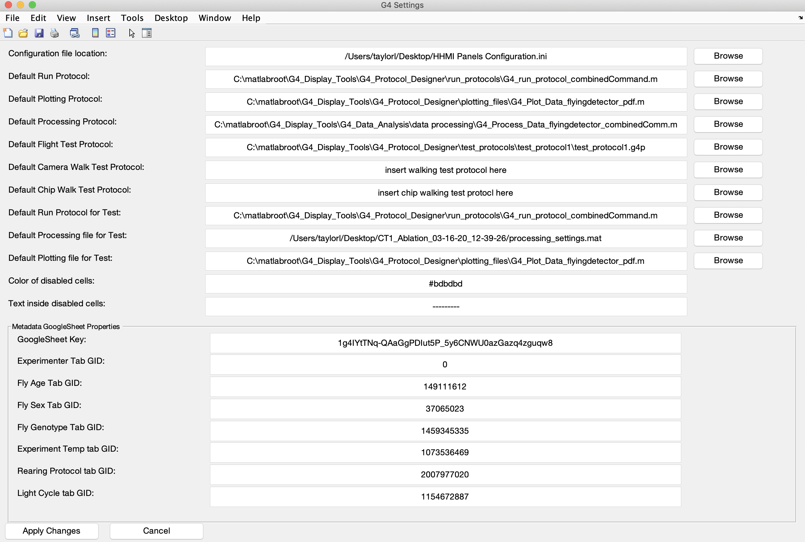

# Prerequisites

You must have cloned the G4 Display Tools repository as described in the [Generation 4 Software Setup](software_setup.md#download-display-tools).

# Getting Started

Many features of the [G4 Designer](protocol-designer.md) and [Conductor](experiment-conductor.md) require that certain settings be configured correctly. Even though some features will work without them, your experience with the [G4 Display Tools](data-handling_getting-started.md) will be smoother if you configure your settings first. You will rarely need to change them after setting them up once. Follow this tutorial to ensure your settings are correct before proceeding to use the Designer or Conductor.

# Configuration file {#main-host-config}

Before you can even open the G4 Designer, you must update one thing - the path to your G4 Configuration file.

Open the file `G4_Display_Tools/G4_Protocol_Designer/G4_Protocol_Designer_Settings.m` in MATLAB, for example by typing `edit G4_Protocol_Designer_Settings` into the MATLAB Command Window. An early line (usually line 3) of this file should look similar to the following:

```conf
Configuration File Path: C:\Program Files (x86)\HHMI G4\Support Files\HHMI Panels Configuration.ini
```

Double check that the file exists at this location as this is required to open the [Protocol Designer](protocol-designer.md). It is also possible to have this file outside the standard location, for example it could be `/Users/taylorl/Desktop/HHMI Panels Configuration.ini` (on a Mac). If the location is not correct, replace the current path with the correct path to your `HHMI Panels Configuration.ini` file. This is the only change you should make to the filet. Please save and close the file when you are done.

__Note__: There should be exactly one space between the ':' and the first character of your path. Additionally there should be no trailing spaces at the end of your path. Please ensure these two things are true before saving and closing the file.
{:.warning}

# Open the G4 Protocol Designer

Make sure that `G4_Display_Tools` and all its sub-folders and files are on your MATLAB path (for details and verification see [Assembly -> Software](software_setup.md)). Then type `G4_Experiment_Designer` into your MATLAB Command Window and hit _Enter_{:.kbd}. Alternatively, you could browse to the file `G4_Display_Tools/G4_Protocol_Designer/G4_Experiment_Designer.m`, open it in MATLAB, and hit _Run_{:.gui-btn}.

A window like the one below will open. If it does not, or if you get a MATLAB error, see the [G4 Designer Manual](protocol-designer.md) for more help on errors and debugging.

{:.pop}

Click _File_{:.gui-txt} → _Settings_{:.gui-txt} in the upper left hand corner of the G4 Protocol Designer window. A second window should pop up that looks like this:

{:.pop}

# The settings

The _G4 Settings_ GUI that just opened is a graphical interface to the configuration file `G4_Display_Tools/G4_Protocol_Designer/G4_Protocol_Designer_Settings.m`. It makes the configuration easier and does some basic checks about the validity of the settings. In addition, here we provide more details for each field in the settings window and what it means.

- _Configuration file location_{:.gui-txt} This field should contain the correct path to your _G4 Main Host_ configuration file. That is the same file [we just updated above](#main-host-config). This file needs to be correctly configured before starting the G4 Protocol Designer, therefore we needed to set it earlier. If you want to use a different arena or setting you can always use this G4 Settings GUI to switch between different files.

- _Default Run Protocol_{:.gui-txt} A _run protocol_ refers to an `.m` file which defines the structure of how an experiment is run on the screens. Refer to the [Run Protocol Tutorial](experiment-conductor_run-protocol_tutorial.md) for more details. While we provide several examples, the default at `G4_Display_Tools/G4_Protocol_Designer/run_protocols/G4_default_run_protocol.m` should be sufficient for most use cases.

- _Default Plotting Protocol_{:.gui-txt} This field only matters if you want to use the [G4 Data Analysis tools](data-handling.md) to run automatic data analysis when an experiment is over (see [there](data-handling_analysis.md) for more details). If you have create a data analysis settings file, which determines how your automatic data analysis will be run, put the path to that settings file here. This may change from experiment to experiment, feel free to update it when you need to. However, this only controls the default settings file and you can choose a different settings file [when you run your experiment](experiment-conductor.md).
  
- _Default Processing Protocol_{:.gui-txt} Like the plotting protocol, this field only matters if you will be using the [G4 Data Processing tools](data-handling.md) to automatically process your data into datasets after an experiment (see [there](data-handling_analysis.md) for more details). If you have created a settings file for your data processing which you want to run at the end of each experiment, put the path to that settings file here. Like the previous field, this only defines the default and you can choose a different one when actually [running the experiment](experiment-conductor.md).

- _Default Flight Test Protocol_{:.gui-txt} This refers to an experiment protocol (a `.g4p` file) which would be used as a test run for your flight experiments. It is common to run a quick test with just a few patterns before a full experiment to make sure your fly is responding as expected and responses look normal. We have provided a simple test protocol like this, located in `G4_Display_Tools/G4_Protocol_Designer/test_protocols/test_protocol1/test_protocol1.g4p`. This test protocol folder contains all the patterns and files commonly used in the Reiser lab protocols. You may find it more useful to customize a short test protocol and provide the path to the `.g4p` files here.

- _Default Camera Walk Test Protocol_{:.gui-txt} This is the location for the walking test protocol and otherwise the same as the previous field. The field either requests a `.g4p` file or can contain the string _insert walking test protocol here_{:.gui-txt}.

- _Default Chip Walk Test Protocol_{:.gui-txt} This is the same as the previous two fields, but should contain a test protocol for chip walking experiments instead of flight.

- _Default Run Protocol for Test_{:.gui-txt} If you have a _test protocol_ in any one of the previous three fields, you'll need to designate a _run protocol_ to run it. This _run protocol_ serves exactly the same purpose as the _Default Run Protocol_{:.gui-txt}, but applies to all _test protocols_ instead of your actual experiment protocol. In most cases this will be the same run protocol as your _Default Run Protocol_{:.gui-txt}, but there is an option to further customize it. This _run protocol_ should be a path to an `.m` file. We provide a default for you at `G4_Display_Tools/G4_Protocol_Designer/run_protocols/G4_default_run_protocol.m`.
  
- _Default Processing file for Test_{:.gui-txt} Similarly to the _Default Processing Protocol_{:.gui-txt}, this field defines the processing protocol for the _test protocols_ and is only required if at least one of them is set. While customizable, this is most likely the same `.m` file used for the main experiment.

- _Default Plotting file for Test_{:.gui-txt} Similarly to the _Default Plotting Protocol_{:.gui-txt}, this field defines the plotting protocol for the _test protocols_ and is only required if at least one of them is set. While customizable this field most likely contains the same `.m` file used for the main experiment.

- _Color of disabled cells:_{:.gui-txt} This field defines a color in the six-digit form of a [hexadecimal code](https://en.wikipedia.org/wiki/Web_colors#Hex_triplet). It defaults to `#bdbdbd`, which is a grey color. You can change this if you'd like to change the background color of table cells in the [G4 Protocol Designer](protocol-designer.md) when they are disabled. For example, in certain [modes](protocol-designer_display-modes.md), a condition does not take a position function. If this is the case, the table cell for position functions will be drawn in the background color defined here (default: gray). You can change the fill color here if you like.

- _Text inside disabled cells_{:.gui-txt} The text that will fill disabled table cells in the [G4 Protocol Designer](protocol-designer.md). By default, they will turn gray and be filled with dashes, _--------_{:.gui-txt}. You can change this to any string if you prefer, such as _disabled_{:.gui-txt} or _////////_{:.gui-txt}.

The bottom section contains a panel called _Metadata Google Sheets Properties_{:.gui-txt}. Please refer to the [Setting up your Google Sheets tutorial](protocol-designer_metadata_tutorial.md) for an explanation of these settings.

# What if I don't have some of these?

That's okay! Although some of the settings are required such as the _Configuration file location_{:.gui-txt}, the _Default run protocol_{:.gui-txt}, the _Color of disabled cells_{:.gui-txt}, the _Text inside disabled cells_{:.gui-txt} and some Metadata settings (see [tutorial](protocol-designer_metadata_tutorial.md) for details). Some of these and other field provide default values or they can be left blank. The GUI might warn you about missing values, but you are always free to ignore these warnings.

__Note__: When you click _Apply Changes_{:.gui-btn} the software will check some of the values for validity. If a field is empty or contains a path that doesn't exist, you will get a pop up warning you about it. If you don't care about that field click _OK_{:.gui-btn} to close the warning boxes. The settings will still be saved.
{:.warning}

Once your settings are how you want them, just click _Apply Changes_{:.gui-btn}, close the window (_File_{:.gui-txt} -> Close{:.gui-txt} or _X_{:.gui-btn}) and you are done! If you want to continue the G4 Protocol Designer tutorials, have a look at the [Metadata tutorial](protocol-designer_metadata_tutorial.md).
