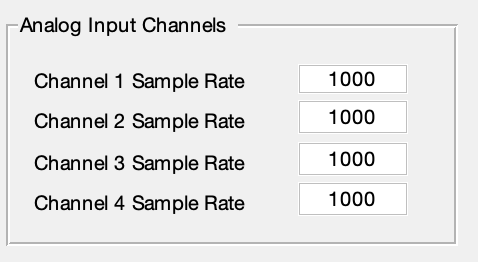

# Prerequisites

- [G4 Software Setup](software_setup.md)
- You must have created and saved all patterns needed for the experiment using the [G4 Pattern Generator](pattern-generator.md)
- You must have created all the functions you need for the experiment (assuming you need any) using the [G4 Function Generator](function-generator.md)

# Creating a single condition

Before starting this tutorial, please complete the [tutorial to create a condition](protocol-designer_create-condition_tutorial.md). It will take you through step by step how to get your experiment started. This tutorial will pick up where that one left off, so please leave the designer with your condition open and return here when you are finished to continue creating a full experiment.

# Autofill

Now that you've gone through the condition tutorial, you know how to make one condition the hard way. There are features in the designer which make this process faster.

For example, click the *Auto-Fill*{:.gui-btn}.

When you click *Auto-Fill*{:.gui-btn}, the software does several things.

- It creates a pre-trial, inter-trial, and post-trial. It uses the first pattern and first function of the set that you have imported (first meaning the one with the lowest ID value). It defaults to mode 1 and a duration that matches the position function.
- It creates one block condition for each pattern you have imported. The default mode is 1.
- It matches a position function to each block condition. Essentially behind the scenes it lists all patterns and functions in ascending order by ID value. The first pattern is matched to the first function, the second pattern to the second function, etc. If there are fewer functions than patterns, it will cycle through the list of functions a second time.

Make sure you have imported at least two patterns and one function, and then click *Auto-Fill*{:.gui-btn} to test this feature out yourself. In my example, I have imported five patterns and one function, and *Auto-Fill*{:.gui-btn} produces this:

{:.pop}

It's unlikely that you will want your experiment organized in exactly this order. Auto-Fill is not meant to create your experiment but simply to give you a starting point. However, when you're creating your patterns and functions, it might be helpful to keep the Auto-Fill function in mind. If you know what order you want your patterns to run in the experiment, giving them ID values ascending in that order will make organizing the experiment much easier in the Designer.

# Moving and Reorganizing Block Trial Conditions

Now that you've made a condition for every pattern, there are several ways to reorganize things.

As in the previous tutorial, you can click on any cell in the table. If it is a pattern or function cell, your available imported files will appear in the text box to the right of the preview screen. You can change the item in the cell by clicking the new pattern or function you wish to place from this list and hitting *Select*{:.gui-btn}. You may also simply erase the current contents of the cell and hit enter to leave it blank.

If you wish to use a different mode, just erase the current mode and type in a number 1-7. This will automatically change which cells are disabled. Here is an example of what various modes look like:

{:.pop}

Notice the buttons to the right side of the Block Trials table. These include the *Shift Up*{:.gui-btn}, *Shift Down*{:.gui-btn}, *Add Trial*{:.gui-btn}, *Delete Trial*{:.gui-btn}, and *Invert Selection*{:.gui-btn}. These can help you re-organize your conditions.

Select the first block condition by clicking the checkbox at the very end of the row, then click *Shift down*{:.gui-btn}. Notice your selected condition will shift down to the second row, moving the second row item into the first row. Now click *Shift up*{:.gui-btn}. This will shift your condition back up to the first row.

You can also use these buttons with multiple rows selected. Check rows 3 and 4 in addition to row 1, then click *Shift down*{:.gui-btn}. You'll notice every selected item is shifted down, from the bottom to the top. Click *Shift up*{:.gui-btn} to see this same process in reverse.

Now, with all three of these conditions still selected, click *Add trial*{:.gui-btn}. A copy of each selected condition, starting with the top, will be added to the end of the block trials. If only one trial is selected, only that trial will be added to the end of the block trials.

Hit *Delete Trial*{:.gui-btn} and your three selected conditions will be removed.

Now none of your conditions are selected. Without selecting any, click *Add Trial*{:.gui-btn} again. It still works. The new condition added to the end of the block is a copy of the last condition in the block. Delete, Shift up, and Shift down, however, do not work without at least one trial selected.

Last is the *Invert Selection*{:.gui-btn} button. Select a couple, but not all, of your block trials and click invert selection. It will automatically un-select all of your selected trials and select all of your un-selected ones. This can be very handy if your experiment contains two different types of condition and you want to apply some change to all of them at once. You have to select all conditions of one type by hand the first time, but afterward you can use the invert selection button to change your selection to the other type. In other scenarios, you may not use this feature much.

# Pre, Inter, and Post-trial conditions

{:.ifr .pop}

Notice that these buttons do not have any effect on the Pre, Inter, and Post-trials. These trials are usually just created manually, by the method shown in the previous tutorial on how to create a condition. However, there are a couple other tools you can use to speed this up.

Select one of your conditions in the block trials. Then go to *File*{:.gui-btn} → *Copy To*{:.gui-btn}. A box like this will pop up:

Select one or more of the options and click *OK*{:.gui-btn}. You can select them one by one, or you can click the *Select All*{:.gui-btn} button at the bottom to select all three. The condition from your block trials which you have selected will be copied into all the tables that you chose in the pop up box - the Pre, Inter, or Post-trial areas. If you have a single trial you want to serve as pre, inter, and post-trial, or two of the three, this is a slightly quicker way to create them.

Now select several conditions in your block trials. Then go to *File*{:.gui-btn} → *Set Selected...*{:.gui-btn}. This feature will likely not be used much, but I just want to make you aware of it. In this case, a pop up window will appear giving you a field for every cell in the condition, like this:
{:.clear}

{:.ifr .pop}

Here you can type in the value for each field. Be aware that there is no error-checking here. It is up to you to make sure you type in the pattern and function names correctly. Otherwise when you try to run the condition, you will get an error because the screens will not be able to find the correct pattern or function file. You should also put in a frame index of 1, assuming you are not using a mode in which you might make the frame index something else. Frame index is, by default, 1. Type in mode 1, a pattern name, a function name, a frame index of 1, and a duration (any number). The rest you can leave blank, and click *OK*{:.gui-btn}. Every condition you have selected will be filled in with this information. This is another easy way to create many copies of the same condition.

# In-screen Preview

In the condition tutorial, you went through how to preview a condition, using the Preview and Dry Run buttons on the bottom left. But we pretty much ignored in the in-screen preview. Let's go through that now.

Click on the pattern name in one of your conditions. When you click on it, the Preview pane should populate as shown below:
{:.clear}

{:.pop}

Below the in screen preview are a number of buttons. Click *Forward Frame*{:.gui-btn}. Your pattern preview should change slightly. This button allows you to move through each frame in the pattern. Patterns are 3 dimensional arrays. The first two dimensions indicate the width and height of the pattern. The third dimension determines the number of frames in the pattern, so *Frame Forward*{:.gui-btn} and *Back Frame*{:.gui-btn} move you forward and backward through this third dimension. If you don't want to look at each frame individually, click *Play*{:.gui-btn}. This will cause the pattern to play through each frame at a relatively slow frame rate. You may hit *Pause*{:.gui-btn} to stop this play back where it is. Hit *Stop*{:.gui-btn} to stop the playing and return the preview back to the first frame. This allows you to explore any imported pattern and make sure it is as you expect.

Notice that there are two greyed out buttons - *Page Up*{:.gui-btn} and *Page Down*{:.gui-btn}. You can ignore these. They are possible additions for the future if we were to implement the possibility of four-dimensional patterns, but as of now they are irrelevant.

Now click on a function in one of your conditions. The pattern display should be replaced by a graph of your function. The buttons below have no effect on this, as the function is simply a two-dimensional plot.

You may see a red vertical bar somewhere on your function. This indicates the duration set for the condition the pattern is in. For example, in this preview, the condition's duration is set to 3 seconds. Notice that the upper x-axis of the shown function represents time, and ends at 3 seconds.

{:.png}

This is why the red vertical bar lines up with the end of the function. The red bar does not have to line up with the end, but normally this is what you would want, and condition that plays long enough to get through your position function exactly once. Of course, this is only relevant in modes that use a position function.

The red bar has no function other than to allow you to easily see if your condition's duration does not match up with your function length. If the red bar is not visible at all, then the duration of your condition is longer than the function's time axis. If it is somewhere in the middle of the function, then it marks the spot in the function where your condition will stop playing.

Analog Output functions preview in exactly the same way as position functions. After all, they are all just functions. They only differ in their location in the table.

# In screen preview on the arena (optional - only works if the screens are working and connected)

You might have noticed a small checkbox in the bottom right hand corner called *Arena preview*{:.gui-txt}. It is unchecked by default.

If you check this box, then whenever you click on a pattern in its table, you will not only get a preview on the preview panel, but also on the arena screens. The first time you do this, this may take a little bit because the Designer has to open up the Panel Host, establish a connection with the screens, etc. But once the pattern has appeared on the arena screens, the display on the screen will react exactly the same as the in-screen preview does when using the playback buttons below. This allows you to see how each frame of your pattern appears on the screen.

This is different from the *Dry Run*{:.gui-btn} we discussed in the condition tutorial. The dry run plays an entire condition. This feature only shows you a single pattern, and lets you play through each frame in the pattern to see what they all look like. The condition, when played, may look much different depending on the mode and/or position function.

NOTE: If you have not saved your experiment, this feature may not work. The reason is that, to display a pattern on the screen, the screen needs to know which folder the pattern is from. If you have saved the experiment, then it knows to look in the saved folder, but if you have not, it will look in the last folder files were imported from. If you imported files from multiple locations, it may generate an error because it could not find the correct pattern. So it is easiest to use this feature after you have built and saved the experiment, to then go through your patterns and make sure they look correct on the arena.

# Other Experiment Parameters

Now that you're familiar with the tables and previewing options, lets look to the left side of the Designer.

{:.ifr .pop}

Click the *Calculate Experiment Length*{:.gui-btn} button. As you might expect, it provides you with an estimate of how long your experiment will take as it is arranged at that moment.

Below this button is a panel containing two radio buttons. You must choose one option or the other.
{:.clear}

{:.ifr .pop}

If you select *Randomize Trials*{:.gui-txt}, then every time your main block of trials runs, the conditions will be run in a random order. If you select *Sequential Trials*{:.gui-txt}, then every time the main block plays, the conditions will play in the order that they appear in the Block Trials table. For an example of the difference, refer back to the beginning of the [condition tutorial](protocol-designer_create-condition_tutorial.md).

Beneath the panel you'll see a text box labeled *Repetitions*{:.gui-txt}. This refers to the number of times the *Block Trials* as a whole will be repeated. The pre-trial and post-trial are not included in these repetitions. The default value here is 1. Change it to 3, and then click *Calculate Experiment Length*{:.gui-btn} again. You'll see that the experiment length will be updated to take into account how many times the block is repeated.

Next is the *Run Trials*{:.gui-btn}. You can always open the G4 Conductor directly and open a previously saved experiment to run it. But you can also run an experiment immediately after saving it by clicking this button. It will open the Conductor and automatically load into it the experiment that is currently open in the Designer. A few things to note:

- You must have saved the experiment in the Designer before you click this button.
- If you make changes in the Designer after you have clicked this button, those changes will NOT be reflected in the Conductor. You must close the Conductor, re-save the experiment in the Designer, and then click this button again to open a new instance of the Conductor with the updated experiment loaded.

The next panel allows you to set the sample rates of any Analog Input Channels you might be using.

{:.ifr .pop}

If you do not want to use an input channel, simply set its sample rate to 0. It's common in our lab not to use any of them. Otherwise, this should be the sample rate (in Hz) that you want your input channel to use.

Go ahead and type '500' into the Channel 1 Sample Rate, and hit 'Enter'. A pop up window will appear warning you that your sample rate is not a multiple of 1000. This is not an error. In our lab, it is most common that sample rates will be multiples of 1000, and so we incorporated this warning to let us know if what we entered is not a multiple of 1000. It is just intended prevent common typos, like leaving off one of the zeroes. The sample rate will still be used as you put it in, so you can simply click ok and move on if the number you put in is not an error.

We've already discussed the next panel, containing the screen size options.

Below this is a quick reference to the modes and what each one does. It is just there for your convenience.

You've now been introduced to everything you need to create an entire experiment. Once all of these parameters are set how you want them, the last thing you need to do is give your experiment a name. At the very bottom of the screen you will seen an *Experiment Name*{:.gui-txt} textbox. When you save your experiment, it will be saved under this name with a timestamp attached, so make the name descriptive so you will remember which experiment it refers to. In this case, you might enter something like 'Tutorial_Exp'.  I recommend that you do not have any spaces in your name. If you are using windows this is likely okay, but on other operating systems, trouble might arise from trying to find a filepath with spaces in it. Replace spaces with dashes or underscores.

# Saving

Now that you've created an experiment, let's save it! Go to *File*{:.gui-btn} → *Save As*{:.gui-btn}. This window will appear:

{:.pop}

Notice the program added a timestamp to the end of your experiment name automatically, and gave it the extension '.g4p.' This is the extension we assign to the .mat file which contains all the parameters and conditions for your experiment. It stands for G4 Protocol.

Browse to the location you want to save and click save. Notice that it does not just save the .g4p file. There should now be a folder in the location you chose with the same name as the .g4p file. The inside of the folder should be structured something like this:

{:.pop}

In this scenario, tutorial10-08-20_10-35-14 is what is referred to in the documentation as my Experiment Folder. It contains everything needed to run this experiment. Inside is the .g4p file as well as the currentExp.mat file. This .mat file contains data regarding the patterns and function in your experiment, but you don't need to do anything with it. It should then contain three folders: 'Patterns', 'Functions', and "Analog Output Functions.' Inside each are both the binary files (.pat, .pfn, .afn) and .mat files associated with each pattern or function. Do not alter or move any of these files. Leave the folder arranged how it is.

You may have noticed that there is no *Save* menu option, just *Save as*. This is intentional to prevent an experiment from being overwritten.

Now that you have saved your experiment, go back to the designer and make a change other than the experiment name. Leave the experiment name the same. Perhaps you forgot to switch from *Sequential Trials*{:.gui-txt} to *Randomize Trials*{:.gui-txt}. Once you've changed this, go back and click *File*{:.gui-txt} → *Save as*{:.gui-txt} again. You'll notice that in the browser window, the file name under which you're saving the experiment has automatically updated the timestamp. Go ahead and browse to the same location you saved the experiment before, and save it again. You will find you now have two experiment folders, both with the same name but a different timestamp. When you edit an experiment and save, this is always how it will work. You cannot save over a previous experiment. So if you need to update an experiment, go ahead and do so and re-save it. You must then go back and delete the previous experiment folder manually if you would like to do so.

# Clear and start again

After you have saved your experiment, click the *Clear All*{:.gui-btn} button in the top right hand corner. You'll get a pop up window reminding you to save your experiment if you haven't. Hit continue. This will clear everything out of the designer. Your imported files will be gone, your parameters will re-set to default values.  This is handy if you would like to sit down and design multiple experiments in a row. Just remember that clicking this button will get rid of all the data in the Designer, so if you click it before you save the experiment, you will lose your work!

Congratulations! You've designed an experiment! See the [G4 Conductor documentation](experiment-conductor.md) and associated tutorials to learn how to play the experiment you just designed on the screens.
