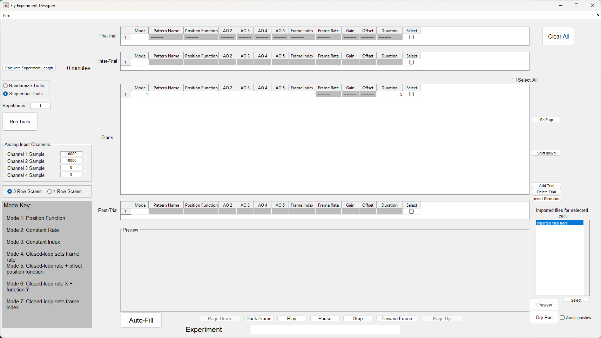

# G4 Software Setup

The software required to run Generation 4 of the Modular LED Display three main parts. The first component is the G4 Host application that directly communicates with the NI IO card. Secondly, a MATLAB programming environment is required to run user interfaces and software developed for the G4 displays. And finally, these user interfaces and software tools need to be installed.

## Download and install G4 Host {#download-main-host}

We provide the G4 _Main Host_{:.gui-txt} application as a compiled binary and free of cost, although we are not at liberty to share the LABVIEW sources. Please [get in contact]({{site.baseurl}}/Contact) if you notice an error or if you have special requirements. The current version requires a two-step process to install: version v1.0.0.230 that is packaged with an installer and an additional patch that upgrades the software to version v1.0.0.235.

The G4 Main Host v1.0.0.230 that is packaged with the installer pulls in required libraries such as the NI R RIO Driver v16.0, NI-Serial v15.0, NI-VISA v16.0, NI System Configuration v16.0 and NI-488.2 v14.0. If you want to use more recent versions that include NI bug fixes and performance improvements, the we suggest installing these NI packages prior to running the G4 Main Host installer since it is more difficult to update afterwards. For us, the link for the [RIO driver](https://www.ni.com/en-us/support/downloads/drivers/download.ni-r-series-multifunction-rio.html)[^1] was difficult to find, but the other software packages are readily available via the search function on the NI homepage <https://ni.com>.

The compiled G4 _Main Host_{:.gui-txt} application in version v1.0.0.230 is available for [download](https://github.com/floesche/LED-Display_G4_Display-Tools/releases/tag/host-v230) ([mirror](https://www.dropbox.com/s/mywy2a3gb6vxhec/HHMI%20G4%20Host%28Ver1-0-0-230%29%20with%20installer.zip?dl=0)). The compressed archive contains an installer that also includes a LabVIEW runtime environment. Once you have installed the application and even if you had previously installed the NI packages separately, we recommend pulling the latest updates through the NI update manager that was installed in the process. You can verify the installation by checking if the G4 _Main Host_{:.gui-txt} software exists in a folder at `C:\Program Files(x86)\HHMI G4`.

In a second step you will need to patch the G4 _Main Host_{:.gui-txt} application to the most recent version. In the lab we have been using [v1.0.0.235](https://github.com/floesche/LED-Display_G4_Display-Tools/releases/tag/host-v235) ([mirror](https://www.dropbox.com/s/cuhs907arnx4kfq/G4%20Host(Ver1-0-0-235).zip)) for some time, but we are [currently publishing updates](https://github.com/floesche/LED-Display_G4_Display-Tools/releases) that [fix bugs](https://github.com/JaneliaSciComp/G4_Display_Tools/issues?q=is%3Aissue+is%3Aopen+label%3A%22Main+Host%22) but are less tested. Download the archive of your choosing and unzip the file to a temporary directory. Then replace the G4 _Main Host_{:.gui-txt} files in `C:\Program Files(x86)\HHMI G4` with your recently downloaded version.

## Download and install MATLAB {#download-matlab}

Download and install the [latest version of MATLAB](https://www.mathworks.com/products/matlab.html). Required toolboxes are [instrument control](https://www.mathworks.com/help/instrument/index.html), [signal processing](https://www.mathworks.com/help/overview/signal-processing.html), and [statistics and machine learning](https://www.mathworks.com/help/stats/index.html). A recommended toolbox is [parallel computing](https://www.mathworks.com/help/parallel-computing/index.html). You will need a license to run MATLAB and many research institutions have campus licenses available.

__Matlab Versions__: This software has been tested and is compatible with matlab versions R2019b...R2024a. New matlab versions will be tested as they are released. It has not been tested on any versions prior to R2019b.
{:.info}

## Download Display Tools {#download-display-tools}

{:standalone .ifr data-img-class="pop"}

To download the G4 Display Tools, navigate to the [G4_Display_Tools GitHub Repository](https://github.com/JaneliaSciComp/G4_Display_Tools). There are two different ways to download the Display Tools: either through git or by downloading a recent archive in your web browser. Download the software to a directory of your choice (e.g. `%HOMEPATH%\srcs\G4_Display_Tools`) using either method. If you know about git and know how to download the files you can skip to the next heading.

__Small detour__: using git allows easy updates of the Display Tools in the future but requires additional software on your computer, namely a git client. Instead, using the _download ZIP_ option gives quick access to the most recent version of the G4 Display Tools, but updates are a bit more difficult and potentially dangerous.
{:.info}

[Git](https://git-scm.com/) is a software to control different versions of files within a single directory. Git and other so called version control systems are efficient in recognizing even small changes in a path that contains many (hundreds, thousands, …) files. Organized in these so-called repositories, git makes it easy to keep track of the different combinations of changes over time. We share our G4 Display Tools git repository on the website GitHub. This means whenever we fix bugs and update the software, you can just _pull_ the latest release with a simple command (or button click).

If you don't want to [read more about git](https://git-scm.com/book) now, [GitHub Desktop](https://desktop.github.com/) is an easily accessible GUI to get started: Just download and install the [GitHub Desktop](https://desktop.github.com/). Once started, go to _File_{:.gui-btn} → _Clone Repository_{:.gui-btn}, and click on the _URL_{:.gui-txt}. There you can paste the G4 Display Tools HTTPS URL <https://github.com/JaneliaSciComp/G4_Display_Tools.git> and configure your local path where you want to store the software (e.g. `C:\Users\YOURNAME\srcs\` - this will download a copy to `%HOMEPATH%\srcs\G4_Display_Tools`). If you want to update the software at a later point, you can do this by clicking _Repository_{:.gui-btn} → _Pull_{:.gui-btn}.

Instead, if you download the ZIP file from the GitHub repository website, this is a one-time solution. If you want to update the software at a later point, you will need to delete the existing directory and replace it with a [freshly downloaded version from GitHub](https://github.com/JaneliaSciComp/G4_Display_Tools). There is a danger that this might delete some of your own files, a problem unlikely to happen when using git instead.

## Set up Display Tools in MATLAB {#add-to-path}

For full functionality, you must add the folder with your downloaded G4 Display Tools to the MATLAB path.

On the MATLAB home tab, click _set path_{:.gui-btn}, then _add with subfolders_{:.gui-btn}. Next, browse to the location where you downloaded G4_Display_Tools, save and close the _Set Path_{:.gui-txt} window.

Alternatively, in the _Current Folder_{:.gui-txt} pane in MATLAB, browse to the location where you saved G4_Display_Tools, right click this folder, and select _Add to Path: Selected folders and subfolders_{:.gui-btn}.

## Verify that old software is not interfering {#verify-old}

If you have previously used a version of Modular LED Displays, please ensure that `C:\matlabroot\PControl_G4_V01\TDMSReaderv2p5` is NOT on your MATLAB path. This folder contains files from previous versions of this software that may conflict with the current files. You can check this via the MATLAB command `contains(path, "TDMSReaderv2p5")` – a return value of `1` means the folder needs to be removed from your path.

## Configure the arena size for the display controller {#configure-controller}

Open the Display controller configuration file in located in `C:\Program Files (x86)\HHMI G4\Support Files\HHMI Panels Configuration.ini` in a text editor such as notepad. Make sure that the `number of rows` field has the correct number of rows based on the size of LED arena you have built (e.g. for an arena that has 12 LED panel columns with each column 4 panels tall, the number of rows is 4.) The `number of columns` field should be the number of columns that the arena can support – not how many columns have been populated with LED panels – which is 12 for standard LED arenas.

## Configure the arena size for the PControl software {#configure-pcontrol}

In MATLAB, open `G4_Display_Tools\PControl_Matlab\userSettings.m` and set the `NumofRows` and `NumofColumns` fields to the same values set for the display controller. If the arena will be mounted upside-down (i.e. if the arena will be mounted with the bottom board on the top and vice versa), set `flipUpDown = 1` and `flipLeftRight = 1`. Otherwise if the arena will be mounted right-side up, set both to `0`.

## Configure the arena size for the Pattern Generator software {#configure-pattern-generator}

In MATLAB, run `configure_arena` (located in `G4_Display_Tools\G4_Pattern_Generator\support\configure_arena.m`). Make sure the # of rows/columns of panels is correct. If you are using G4 panels consisting of 16x16 LEDs, set the panel size to be 16. If you are using a G4 arena consisting of 12 LED columns that would fully enclose the cylindrical arena (e.g. the 12" arena), set the arena circumference to 12. If you are using a differently-sized arena, such as the open-form 12/18 cylindrical arena (where 18 panel columns would be needed to fully enclose the cylinder), set the circumference to 18. If the center of the arena (located between columns 6 and 7) is not oriented directly "forward" from the center of the cylinder, use the `arena rotations` to account for that, otherwise some motion types will not be oriented correctly.

## Verify software is working {#verify}

After the hardware and software setup is complete, try to start the application `Panel_Host` that you previous installed in `C:\Program Files(x86)\HHMI G4`. Instead of running the `g4host.exe` directly, calling the command `PControl_G4` in MATLAB should open two two windows: the _Panel_Host_{:.gui-txt} LabVIEW window and a MATLAB GUI.

Switch to the _Panel_Host_{:.gui-txt} window and try to send an _all on_{:.gui-btn} command through the interface. If this is the first time you send a command, the Windows firewall might ask you to _allow network access to the `g4host.exe`_{:.gui-txt}. To use the G4 system, you will need to grant that right. If the arena is connected and powered on, all panels should light up -- if not, have a look at the [troubleshooting guide]({{site.baseurl}}/docs/g4_troubleshooting.html) or [get in contact]({{site.baseurl}}/Contact). Turn them back off by sending the _all off_{:.gui-btn} command through the GUI.

The second test will verify that the connection between MATLAB and the _Panel_Host_{:.gui-txt} software is working. Switch back to the MATLAB PControl_G4 GUI and click on the _arena_{:.gui-txt} tab and then _all on_{:.gui-btn}. If all LEDs on the arena turn on, then the system has been set up successfully -- and you can turn it off the same way as before. Otherwise and most likely you will need to [trouble shoot your system]({{site.baseurl}}/docs/g4_troubleshooting.html) or [get in contact]({{site.baseurl}}/Contact).

Next we'll verify the Experiment Designer and Conductor are working. Open the file `G4_Display_Tools\G4_Protocol_Designer\G4_Experiment_Designer.m` and click `Run` on the matlab editor. A window should open that looks like this. 

{:.pop} 

In the top left corner, click File -> Settings and a settings window should open. The first item in the settings is the filepath to your HHMI Panels Configuration.ini file. Please make sure this path is accurate, or update it if necessary. Then click "Apply Changes", close the settings window, and close the Designer.

Now open `G4_Display_Tools\G4_Protocol_Designer\G4_Experiment_Conductor.m` and run the file. A GUI that looks like this should pop up. 

{:.pop}

Go to `File -> Open -> .g4p file` and open one of our two provided test protocols. One is for a screen with three rows and one is for a screen with four rows. Browse to `G4_Display_Tools\G4_Protocol_Designer\test_protocols` and choose the appropriate protocol for your arena. Inside that folder, select the .g4p file and open it. If you get a warning that the experiment couldn't load because the number of rows doesn't match, then the one you opened doesn't match the number of screen rows indicated in your configuration .ini file. 

After opening the protocol, you'll want to uncheck the boxes labeled `Processing?` and `Plotting?` since this is just a test. Then click `Run`. The first condition that runs on the screen is a vertical bar used for fly fixation. It will run until you press a button on the keyboard. You'll need to push a button to continue. Then the rest of the protocol should run. The full experiment should last a minute and a half. Please see the [Conductor documentation](experiment-conductor.md) for more information about this software.

## Verify an experiment can run without the GUI

If you don't want to mess with the Designer and Conductor right now, and instead just want to make sure a protocol can run on the screens correctly, you can run our test protocols without opening up the GUI. To do this, open the file `G4_Display_Tools\G4_Protocol_Designer\support_files\create_metadata_woGUI`. Set the variable `filepath` equal to the full path to the test protocol's .g4p file on your computer, whichever test protocol is appropriate for your arena. Save this file, and then, in your matlab commandline run 

```matlab
[filepath, md, run_test] = create_metadata_woGUI;
run_experiment_woGUI(filepath, md, run_test);
```

After a few seconds to open the Host and load the experiment, the test protocol should begin to display on the arena.

### Create and run an experiment without the GUI

There is one other way to both create and run an experiment without any reliance on the Designer and Conductor software. It requires more coding, but is available for users who are interested in seeing what goes into making an experiment on their own. Open the file `G4_Display_Tools\G4_Example_Experiment_Scripts\create_experiment_G4_example.m`. There you will see a long list of user-defined parameters. For right now, don't edit anything except perhaps the first two items, the name of your test experiment and the path where you want to save it. Simply run the file. You can check the file location listed at the top of the script afterward to confirm your experiment saved. Next, run the file `G4_Display_Tools\G4_Example_Experiment_Scripts\run_experiment_G4_example.m`.

You should see an experiment run on the arena, and text updates should appear in your matlab command window until the experiment is finished. 

## Configure Data Processing

Once you have created your first experimental protocol, it will be time to configure your settings for how the collected data should be processed. Processing happens automatically at the end of an experiment unless you disable this feature before running the experiment. Open the file `G4_Display_Tools\G4_Data_Analysis\new_data_processing\create_processing_settings.m`. This file contains a list of variables, each one affecting how your raw collected data will be turned into easily read datasets. See a full description of each setting and what it means at [G4 Data Processing](data-handling_processing.md). In summary, you will update the variables in this file to match your preferences, and then you will save the file and run it. This will generate a `.mat` file containing all your settings for data processing. When you run an experiment on the Conductor, you will provide the path to this `.mat` file, and the Conductor will then automatically take the raw data and process it into datasets once the experiment is finished according to your settings. You will also be able to manually process data collected from previous experiments this way.

## Configure Data Analysis

Once you have configured your data processing settings (see above) you may also want to configure settings for your data analysis. This refers to the plotting and visualization of the datasets created by the data processing. This is optional, you can of course opt to take your processed datasets and visualize them however you see fit. Automated analysis can be done for a single fly after an experiment by the Conductor. You can also create settings to analyze one or several groups of flies together, though this analysis will then be run by you at your convenience, not run by the Conductor. The basic idea of configuring the data analysis settings is the same as with the processing settings. You will open a settings file, change the values of variables in the file to match what you want, and then run some commands to create a settings `.mat` file which can be saved in your experiment folder. These settings can then be used over and over for a particular experiment. The full version of this is lengthy, as there are hundreds of settings, but there is a simplified version which is sufficient for most use cases and is much easier to configure. See [G4 Data Analysis](data-handling_analysis.md) for an in-depth exploration of these settings and how to run an automated analysis using them.

---

[^1]: In November 2021, the NI R RIO Driver and most other software packages are available in version 21.3 (previously in July 2020: v20.0).
