# Requirements

Before going through this tutorial, you should have done the following:

- created one or more patterns using the [Pattern Generator](About_Pattern_Generator.md)
- created one or more functions using the [Function Generator](About_Function_Generator.md)
- Reviewed the different experiment modes
- [Set up your system]({{site.baseurl}}/docs/G4-Assembly.html).

# Experiment structure

An experimental protocol is really just a set of what we call "conditions." A condition, viewed on the arena screens, is a single pattern being displayed to a fly for some number of seconds. The pattern can be moving, to simulate motion, or still. It can be played in a closed-loop or open-loop way. But the key is that it only involves a single pattern file.

In the G4 Designer, a condition is a single row in a table. The pre-trial (optional) is a single condition that will play at the beginning of the experiment and then will not play again. The inter-trial (optional) is a single condition that will play in between each condition in the main experiment. It can be used to re-set the fly in between the main conditions of the experiment. The post-trial (optional) is a single condition that plays at the very end of the experiment. The block trials, contained in the large central table of the G4 Designer, are a set of conditions. There can be as many conditions in this block as you want. These conditions make up the main experiment and can be played in sequential or random order. 

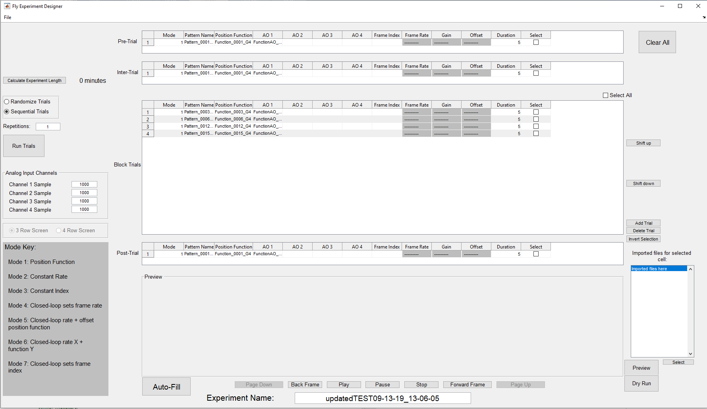{:.pop}

This is an example of a (tiny) experiment. In this case, the experiment will play as follows:

1. pre-trial
1. Condition 1
1. inter-trial
1. condition 2
1. inter-trial
1. condition 3
1. inter-trial 
1. condition 4
1. post-trial

Note that only the block conditions are referred to by their numbers. The others are referred to by their position, pre-, inter-, or post-. Also notice that the inter-trial does not play before the first block condition or after the last block condition.

If, at the left side of the image, we had selected *Randomize Trials*{:.gui-txt} instead of sequential, then the four conditions would play in random order. So it might be something like this:

1. pre-trial
1. Condition 2
1. inter-trial
1. Condition 1
1. inter-trial
1. Condition 4
1. inter-trial
1. Condition 3
1. Post-trial

Only block conditions are affected by the *Randomize trials*{:.gui-txt} feature. We also could have changed *Repetitions*{:.gui-txt} on the left to be more than one. If there are 2 repetitions, that means the block conditions will be repeated a second time. With trials playing randomly, it might look something like this:

1. pre-trial
1. Condition 2
1. inter-trial
1. Condition 1
1. inter-trial
1. Condition 4
1. inter-trial 
1. Condition 3
1. inter-trial
1. Condition 4
1. inter-trial
1. Condition 2
1. inter-trial 
1. Condition 1
1. inter-trial
1. Condition 3
1. post-trial

The set of block trials is played twice, but in random order each time.

So you can see that being able to create a single condition is almost all you need to know in order to create an experiment. Once you can create one condition, all you have to do is make a bunch and put them together.

So what follows is a step by step instructions on how to create a single condition in the [G4 Designer](G4_Designer_Manual.md). Please note that you should already have created any patterns and functions you might need for this. If you have not, please see documentation on the [Pattern Generator](About_Pattern_Generator.md) and [Function Generator](About_Function_Generator.md) for more details.

# Open the designer

First you have to open the Designer. There are two ways to do this. Assuming the [G4 Display Tools are on your MATLAB path](G4_Software_Setup.html#add-to-path), you can simply type `G4_Experiment_Designer` into your MATLAB command window. Alternatively, you can browse to the file `G4_Display_Tools/G4_Protocol_Designer/G4_Experiment_Designer.m`, open the file in MATLAB, and hit *Run*{:.gui-btn} at the top of the MATLAB window.

You should get a screen that looks like this:

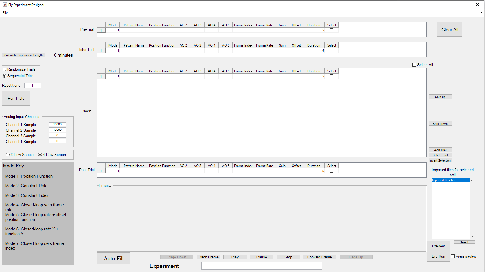{:.pop}

If you get an error, first check that you have the configuration file referenced in [Setup](G4_Software_Setup.md) in place. Then open the file `G4_Display_Tools/G4_Protocol_Designer/G4_Protocol_Designer_Settings.m`. The first line of this file should read: `Configuration File Path: [path to your configuration file]`. If the path here is incorrect, replace it with the path to your Configuration file.

**Please note that there should be exactly one space between the ':' and the first character of your path, and there should be no spaces after the last character of your path.** Once this first path has been set, you should never open this file again, and instead maintain your settings through the settings window in the Designer.

If this does not solve your error, see the [G4 Designer documentation](G4_Designer_Manual.md) for more common troubleshooting.

## Screen size

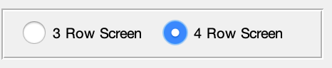{:.ifr .pop}

When you first open the designer, the first thing you should always do is set your screen type. On the left hand side of the designer you should see a pair of radio buttons that look like this:

Some arenas have three rows of panels, and some arenas have four rows of panels. When you create patterns with the Pattern Maker, they are created for one size screen or the other. An experiment cannot contain a mix of 3 row and 4 row patterns. Once you import the patterns you want to use in this experiment, this radio button will grey out and you will no longer be able to change it. This is a safety feature to prevent you from accidentally mixing different size patterns in your experiment.

As such, before doing anything else, you need to select which type of screen this experiment is meant for.

# Import

Once the designer is open, you need to import the patterns you intend to use in the experiment, as well as any functions. To do this, click *File*{:.gui-btn} -> *Import*{:.gui-btn}. A small box should pop up:

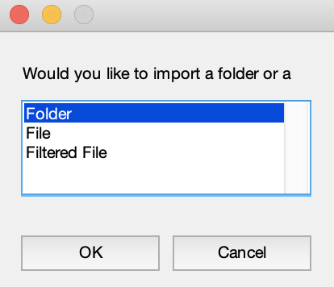{:.ifr .pop}

You have three choices - *Folder*{:.gui-txt}, *File*{:.gui-txt}, or *Filtered File*{:.gui-txt}. If you have saved all of your patterns and/or functions in a folder, then choosing *Folder*{:.gui-txt} might be the most convenient option for you.

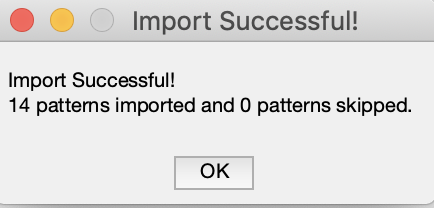{:.ifr .pop}
If you select folder, the Designer will attempt to import all files found in the folder. Don't worry if the folder has irrelevant files in it. The Designer will skip any files it doesn't recognize and provide a summary after the import is complete that looks like this:
{:.clear}

If you would rather import a single file at a time, simply click *File*{:.gui-txt} and browse to the file you want to import. That file could be a pattern .mat file, a function .mat file, or a currentExp.mat file (which you will only have if you have already designed and saved an experiment and you are trying to import that experiment).

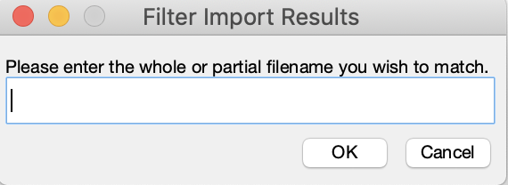{:.ifr .pop}

The *Filtered File*{:.gui-txt} option is there for your convenience. If you have some kind of naming convention for your files, you can provide a string that the file system can use to narrow down your options and only show you files which match the string. For example, if my patterns are all named `Pattern_001.mat`, `Pattern_002.mat`, `Pattern_003.mat`, etc, I can select *Filtered File*{:.gui-txt}. When this box appears. I could type Pattern into the box and hit okay. Now in my browse window, only files with "Pattern" in the name will be available. This is not case-sensitive.

In this case we are only creating a single condition, so select *File*{:.gui-txt} and browse to the .mat file that was produced when you used the Pattern Generator to create a pattern. You should get a little box saying that one file was successfully imported.

The pattern has been imported but not much has changed about the Designer window. Now we can start creating our condition. 

# Add a pattern to your condition

In row 1 of the block trials table, click on the empty box under *Pattern Name*{:.gui-txt}, column 2. Not much happens at first glance -- a cursor appears in the box. But look to the bottom right hand side of the window and you will see the tall narrow box labeled *Imported files for selected cell:*{:.gui-txt}, which was empty before, now has an item in it. The item should match the name of the pattern you imported. 

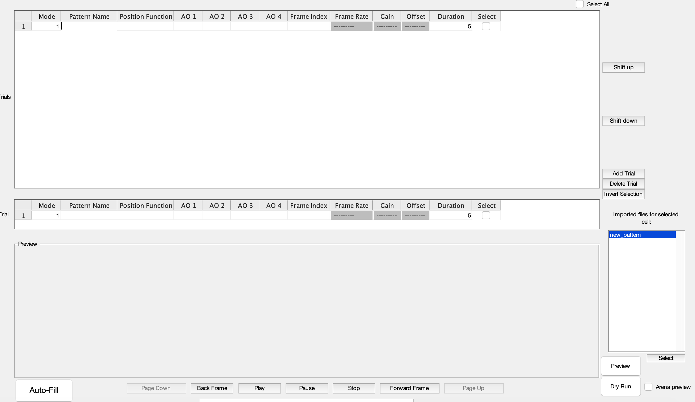{:.pop}

Click on the name of your pattern in that tall box. When you click on it, a preview of the pattern should appear in the preview pane.

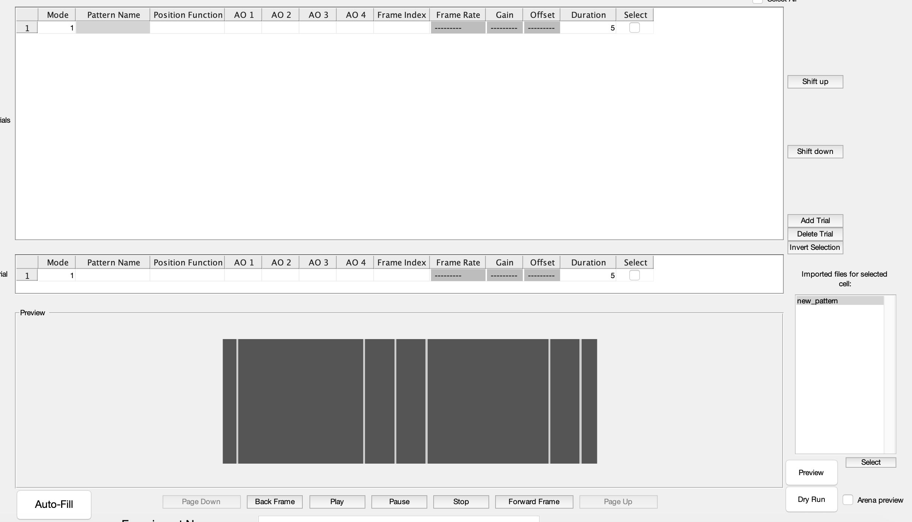{:.pop}

When creating an experiment you would have an entire list of patterns here, and you could click through them, looking at the preview of each one until you find the one you want. It works exactly the same way for functions, when you click the empty cell under *Position Function*{:.gui-txt}.

Once you've verified the pattern looks as you expect, click *Select*{:.gui-btn} under the box. This will populate the table cell with the pattern name.

# Choose your mode

Conditions default to mode 1 but there are 7 modes in all. Mode 6 is currently not functional, but the rest are available to you. When you change the mode, the disabled cells may change. This is because different modes allow different parameters.

For now let's leave it in mode 1. This is the mode that uses a position function to determine which frame of the pattern is displaying at any given time. For mode 1, we need to import a position function. Repeat the import steps above, but this time import a position function that you created with the [Function Generator](About_Function_Generator.md).

# Add a position function

Follow the same steps we completed when adding the pattern. Click the empty table cell under *Position Function*{:.gui-txt}, then click the item that appears in the *Imported files for selected cell:*{:.gui-txt} box. A preview in the preview pane should appear that looks something like this:

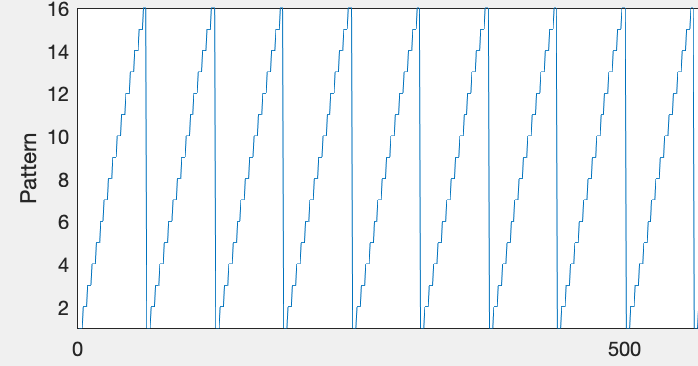{:.pop}

You may see a red vertical line. This matches the duration set in your condition (row 12). Users may often want the duration of their condition to match the duration (x axis limit) of their position function, so the vertical red line just gives a quick and easy way to compare them. If there is no red vertical line, it means your condition duration is larger than the x axis (time) of your function. 

There are for cells for Analog Output functions. These are optional, but if you have them, they work exactly like the position function. The last cells, then, to edit are the Frame Index and the duration. Frame Index should be 1 by default, which means your pattern will start playing from frame 1. You can, however, set this to another number or to the letter 'r' if you want the pattern to play starting from a random frame index. This is only useful for certain modes. 

# Preview your condition

Congratulations, you've made a condition! There are two ways to preview the condition you've just created to see how it looks. 

## Method 1 - doesn't require that you are connected to an arena:

click the check box at the end of your condition to selected it, and then click the *Preview*{:.gui-btn} at the bottom right of the screen. A window will pop up that looks something like this:

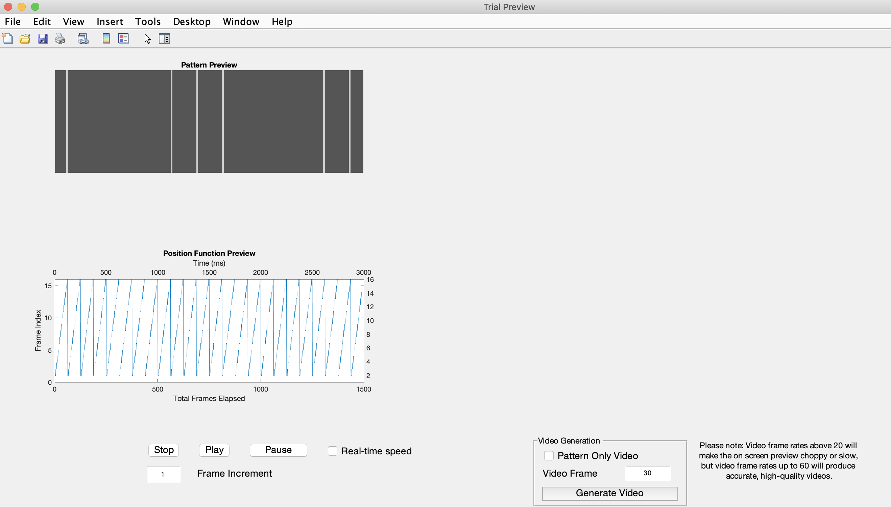{:.pop}

All the blank space in the right half of the screen is where your Analog Output functions will be displayed if you have any.

Hit the *Play*{:.gui-btn} button at the bottom of the screen. Your pattern will begin to move, and a moving vertical bar on the position function will track where you are in the function at any given time. Notice that the condition plays very slowly. By default, it is not playing at the speed it will play on the screen. This is because the arena plays patterns and 500 or 1000 frames per second while your computer screen refreshes at something more like 24 frames per second.

There are some controls which will let you change this. The first is the *Frame Increment*{:.gui-txt} box below the play button. By default it is set to 1 meaning the preview is showing you every single frame of the pattern when it plays. Increase this increment to skip frames and therefore increase the speed of the playback.

Click *Pause*{:.gui-btn} to stop your preview, and then change the frame increment to 10. Hit *play*{:.gui-btn}. You will notice the preview resumes at a much faster pace.

Another useful way to speed up your preview is to check the *Real-time speed*{:.gui-txt} checkbox to the right of the *pause*{:.gui-btn} button. Check this box now.

Notice that the *Frame Increment*{:.gui-txt} updated automatically. It has calculated how many frames it must skip between each frame that is displayed, in order to play the preview as quickly as it will play on the arena screen. Press *Stop*{:.gui-btn} to return the preview back to the beginning, and then click *Play*{:.gui-btn}. The preview should now approximately match the speed with which it will display on the arena.

### Generate a video

From this preview panel you can also generate a video of what your condition will look like. On the right hand bottom side of the screen is a panel that looks like this:

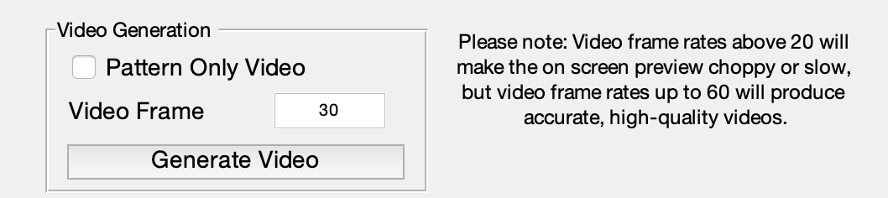{:.pop}

Enter a frame rate of 60 or less and click Generate Video. A window will pop up asking you to name the video and browse to the location where you want to save it. Do this and click *Save*{:.gui-btn}.

A progress bar will appear that looks like this: 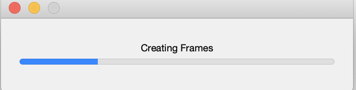{:.ifr .pop}

Wait for the progress bar to finish and close on its own. This may take several minutes. The faster your frame rate, the less time it will take. When it is finished, you will find an .avi video saved where you indicated. This video shows the entire preview window playing the condition, just as when you hit play earlier. Note that the *Real-time speed*{:.gui-txt} box should still be checked. If it is not, then your video will show the preview running at whatever speed indicated by the Frame Increment value. If the frame increment is low, then your video will take both a very long time to generate, and a long time to play. 

Once the video is done generating, go back to the preview window and select *Pattern Only Video*{:.gui-txt}. Now gnerate the video again, ensuring *Real-time speed*{:.gui-txt} is still selected. 

The same thing will happen, but this video, instead of showing the entire preview window, will show only the pattern. This gives a better idea of what the fly will actually see in the arena. 

## Method 2 - requires the arena

Close the preview window.

The second way to preview a condition is to actually play it on the arena. You must meet a few requirements before doing this though.

- You must be connect to the arena and it must be working
- You must have imported your patterns and functions all from the same location
- If your patterns and functions were imported from different locations, you must save your protocol before previewing on the screens. This is because the screens must be given a directory to pull the patterns and functions from, and it can't be given more than one.

To save your experiment (though in this case it is not a full experiment), first give it a name in the *Experiment Name*{:.gui-txt} field at the bottom of the window. Then click *File*{:.gui-btn} -> *Save as*{:.gui-btn}. A timestamp will be added to your name and you can browse to the location where you want to save it.

We will cover saving a protocol and how it works in the experiment design tutorial. I am limiting this explanation to only what you need to know to preview your condition.

Now that the experiment is saved, select your condition using the checkbox on its right end (if it is not already selected) and then click *Dry Run*{:.gui-btn} just below the *Preview*{:.gui-btn}.

You will get a warning saying you must save the experiment before doing a dry run - this is not an error, but just a reminder. We have saved it, and you can just click *OK*{:.gui-btn}.

Give the system a minute. At this point, the software will be running `connectHost` to open up the arena software and connect to the screens. This may take several seconds or even up to a minute. When everything is connected and the system is ready to play your condition on the screens, you will be prompted with a box saying it is ready. You may hit *Start*{:.gui-btn} to start the condition playing on the screen, or *Cancel*{:.gui-btn} to cancel.

The dry run feature allows you to see exactly how your condition will look on the arena. If something is amiss, you can go back and edit your experiment until you get things the way you want. Just don't forget that if you want to do another Dry Run after making changes, you will have to save the experiment again, especially if your imported files come from multiple locations.

# Other Condition fields

Congratulations! You've made your first condition and run it on the screen.

There are a few other fields in a condition that we didn't discuss. They are used in certain modes, and you can find a full explanation in the mode descriptions, which is coming soon.

In short, the *Frame Rate* is used in mode 2. In this case, there is no position function and a pattern simply plays through its frames sequentially at a particular frame rate. This is in frames/second.

The gain and offset affect the appearance of the pattern on the screen and are used in Mode 5.

For additional questions or resources, see the [G4 Designer Manual](G4_Designer_Manual.md).