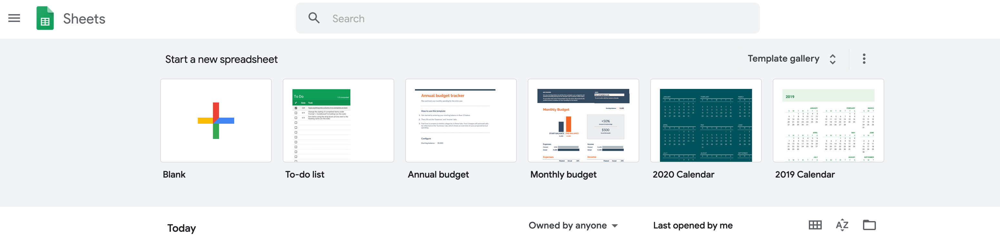
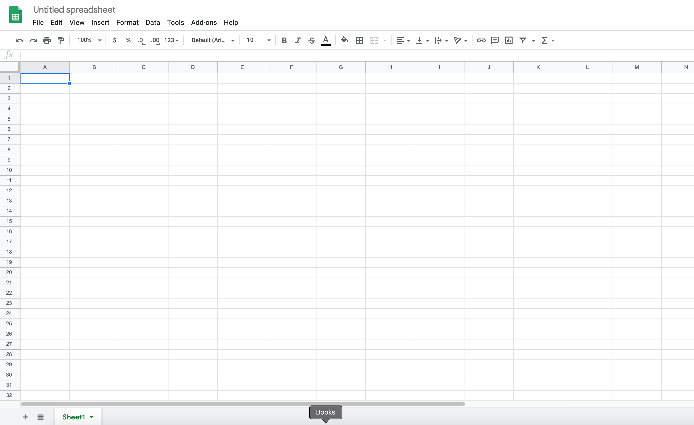
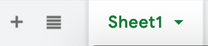
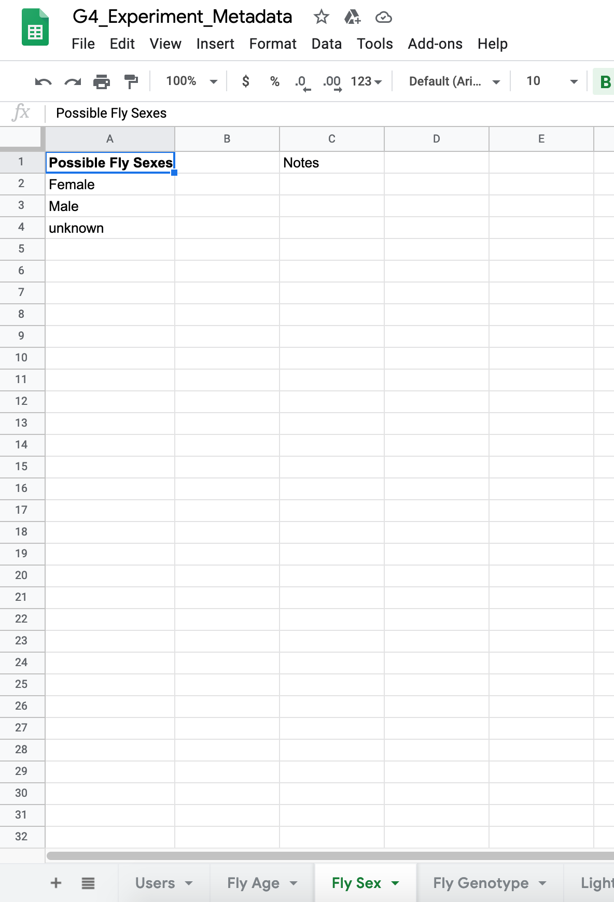
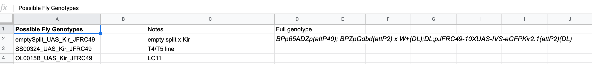
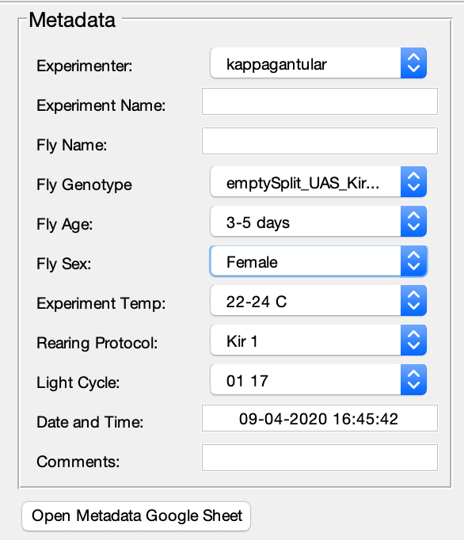
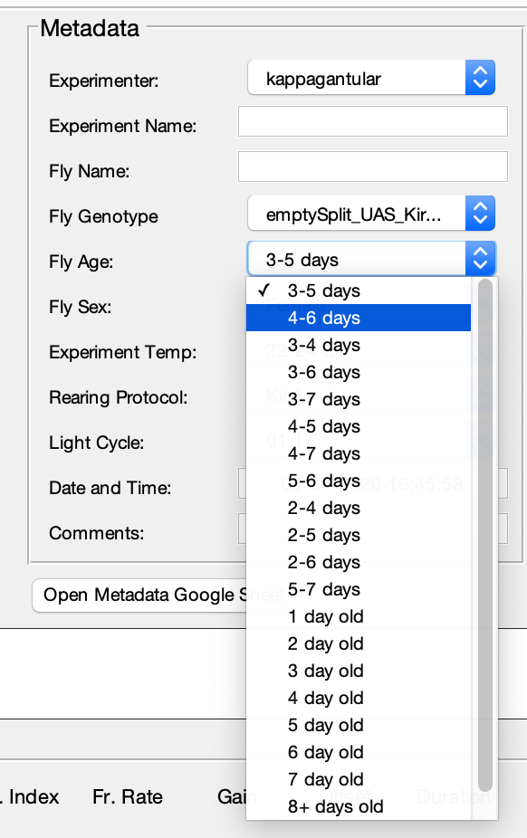

1. TOC
{:toc}

# What are we doing?

When you run an experiment using the [G4 Experiment Conductor](G4_Conductor_Manual.md), there are several metadata fields you'll need to fill out so it is easy later to sort your experiment results by their metadata. The metadata is crucial to looking for patterns in your results, and therefore it's important that everyone fills out the same metadata in the same way.

One can foresee a situation in which experimenters may provide different answers that mean the same thing. For example, one experimenter may write in a fly's age as 2 days, another might write two days, another might write 48 hours. It would be difficult to automatically pull all three of these experiments when looking for experiments done on two day old flies, because the fly age fields do not match.

Google Sheets fixes this problem. Metadata fields required by the G4 Conductor pull predetermined possible values and provide the user a drop down list, so instead of having to type in their own metadata, the user can simply choose the appropriate item. A button is provided on the Conductor that will directly open Google Sheets, making it easy for users to add new possible metadata values if the one they need is not listed.

This must be set up for the Conductor to run properly. Read on for step by step instructions.

# Create a Google Sheets

The first step is to actually create your Google Sheets. Open your preferred internet browser and go to <https://docs.google.com/spreadsheets>.

You may already have a Google account, or you may want to create one for yourself or for your lab. If you need to create a Google account, do so now before moving on. Don't forget to record the username and password in a safe place.

Once you are signed into Google, the Google Sheets page should look something like this:

Click The big plus sign that says "Blank" underneath it in order to start your Google Sheets. Your blank spreadsheet will look something like this:

Click on the words "Untitled spreadsheet" at the top left corner and give your spreadsheet a name which will be easy for you and any other users to remember. This Google Sheets is intended to be used by all users of the G4 system in your lab.

# Tab organization

Now that your Google Sheets are created, the first thing you should do is create all the necessary tabs. The sheet will need one tab for each of the following metadata fields:

- Users
- Fly Age
- Fly Sex
- Fly Genotype
- Light Cycle
- Experiment Temperature
- Rearing Protocol

Future releases will come with the ability to customize these fields, but for now they are all required.

{:.ifr}

Look at the bottom of your Google Sheets and you will see a section that looks like this:

You can rename Sheet1 by simply double-clicking on the text. Alternatively, click the down-pointing arrow to the right of "Sheet1" and select "rename" from the menu that is provided. Rename this tab to "Users" or something similar.

To add a second tab, click on the small black plus sign to the left of your first tab. When you hover your mouse over it, text will pop up that says "Add Sheet." This terminology might be a little confusing, but "tab" and "sheet" are interchangeable here.

Proceed to add a tab for every field listed above and name them appropriately. Their order is not important.

# Adding values to the Google Sheets

When the G4 Conductor accesses one of these tabs to get the list of possible values, it will pull whatever items are in the first column, starting with row 2. This allows you to put a title in the first row so a user knows what the column represents. Here's an example from the Fly Sex tab of our lab's Google Sheets:

There are only three options for this metadata field - Male, Female, and unknown - so these values are placed in rows 2-4 of the first column. If there were more possible answers, we could simply continue adding them to that column. The first row, our title, will be ignored by the program.

The conductor will also ignore all the other columns, so you can put anything you want there. We have a notes column in each of our tabs. This allows us to write a note by each value providing more information if desired. It looks something like this:

Here you can see each genotype has a note next to it providing its shorthand name, and some also have an additional note with the full genotype. This is fine. Only the values in the first column will be pulled by the Conductor.

With all of this in mind, go through each tab and enter a starting set of values. You can always come back and add more later. If you will not be using any of the fields and so don't have any values to add, simply put in an 'N/A' or something similar in column 1, line 2. If this is the only value, then that field will always be marked as N/A in your experiment.

# Connecting the Google Sheets and the G4 Display Tools

So the Google Sheets is done. Great! But how does the Conductor access these values?

To give it access, we must open the [G4 Protocol Designer](G4_Designer_Manual.md). If you've never opened the designer before, [click here](G4_Designer_Manual.md) for details on how to open it. Simply put, you can browse to G4_Display_Tools/G4_Protocol_Designer/G4_Protocol_Designer.m, open this file in MATLAB, and run it. Assuming your path is set up correctly and you have your configuration file in place, it should open the main Designer window.

Once it's open, go to *File*{:.gui-btn} → *Settings*{:.gui-btn} at the top left corner. This window should appear:

At the bottom, notice a panel called *Metadata Google Sheets Properties*{:.gui-txt}. Within this panel are several fields: a Google Sheets key and several types of GID field.

These values are unique codes Google assigns to your Google Sheets and each tab within it, and they are how the G4 Display Tools will access your Google Sheets.

## How to find your Google Sheets Key and GID values

To find the key to your new Google Sheets, look at the address bar of your browser while you have your Google Sheets open. It should read something like this:

`https://docs.google.com/spreadsheets/d/ [Google Sheets Key] /edit#gid= [GID value]`

The [Google Sheets Key] section of the URL will contain a long string. No matter which tab you click on within the Google Sheets, this part of the address should not change. This string should remain the same. This string is your Google Sheets Key. Copy this string (everything between the '/d/' and '/edit') and paste it into the *Google Sheets Key:*{:.gui-txt} field in the Designer's settings window.

The [GID value] section in your url is the GID value for whatever tab you have open in your Google Sheets. Each tab has its own GID value. The first tab you created may have a 0 - that's fine. Google uses these strings, which are usually just a series of digits, to refer to a particular tab inside your Google Sheets. Go through each GID field in the settings window and copy the GID value from the appropriate tab into its text box. For example, the first field reads *Experimenter Tab GID:*{:.gui-txt}. This refers to the Users tab (you could also name it Experimenters, it's up to you). Open the Users tab in your Google Sheets, get the GID value from the address bar (everything after the '='), and paste it into the settings window. Do this for each tab in your Google Sheets.

Your settings window should now look more similar to the photo above, with all the Google Sheets metadata panel filled out. When you are done, click *Apply Changes*{:.gui-btn} at the bottom left hand corner of the settings window, and you are done!

*Note that if you have not filled in all the fields in the top half of the settings window, you may get some pop up errors warning you that one or more of those values are incorrect - as in a "The path you've entered for the Default Camera Walk Test Protocol does not exist" type of warning. You can just click through these and ignore them. The settings will still save.*

You should now be able to open the [G4 Experiment Conductor](G4_Conductor_Manual.md) without error. When you do, check the drop down lists in your metadata panel. They should contain all the values you have provided in your Google Sheets, and look something like this:

To be sure everything has worked correctly, click the *Open Metadata Google Sheets*{:.gui-btn} button. Assuming you are connected to the internet, this should open the Google Sheets you just created in your browser. If you get an error, see the [Final Details](G4_Designer_Manual.md) in the G4 Designer Manual for some common errors and their solutions.
